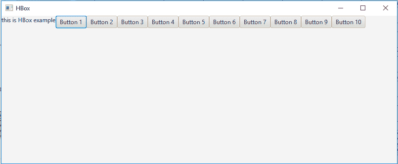
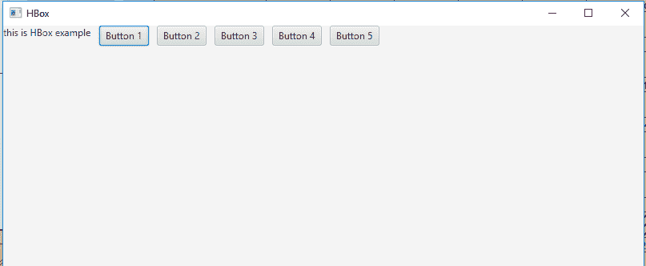
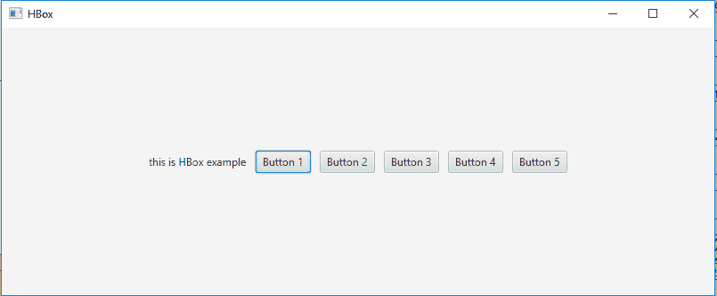

# JavaFX | HBox 类

> 原文:[https://www.geeksforgeeks.org/javafx-hbox-class/](https://www.geeksforgeeks.org/javafx-hbox-class/)

HBox 是 JavaFX 的一部分。HBox 以水平列的形式显示其子代。如果 HBox 设置了边框和/或填充，那么内容将在这些插页中显示。HBox 类扩展了*窗格类*。

**类的构造函数:**

*   **HBox()** :创建一个没有节点的 HBox 对象。
*   **HBox(双 s)** :创建节点之间有间距的 HBox。

**常用方法:**

| 方法 | 说明 |
| --- | --- |
| getAlignment() | 返回属性对齐的值。 |
| getSpacing() | 返回其子对象之间的间距。 |
| 设置对齐(位置值) | 设置 HBox 的对齐方式。 |
| getChildren() | 返回 HBox 中的节点。 |

以下程序说明了 HBox 类的使用:

1.  **Java Program to create a HBox and add it to the stage:** In this program we will create a HBox named *hbox*. Now create a label and add it to the *hbox*. We will also create some buttons and add them to the HBox using the *getChildren().add()* function. Now create a scene and add the hbox to the scene and add the scene to the stage and call *show()* function to display the final results.

    ```
    // Java Program to create a HBox
    // and add it to the stage
    import javafx.application.Application;
    import javafx.scene.Scene;
    import javafx.scene.control.*;
    import javafx.scene.layout.*;
    import javafx.stage.Stage;
    import javafx.event.ActionEvent;
    import javafx.event.EventHandler;
    import javafx.scene.canvas.*;
    import javafx.scene.web.*;
    import javafx.scene.Group;

    public class HBOX_1 extends Application {

        // launch the application
        public void start(Stage stage)
        {

            try {

                // set title for the stage
                stage.setTitle("HBox");

                // create a HBox
                HBox hbox = new HBox();

                // create a label
                Label label = new Label("this is HBox example");

                // add label to hbox
                hbox.getChildren().add(label);

                // add buttons to HBox
                for (int i = 0; i < 10; i++) 
                {
                    hbox.getChildren().add(new Button("Button " 
                                               + (int)(i + 1)));
                }

                // create a scene
                Scene scene = new Scene(hbox, 800, 300);

                // set the scene
                stage.setScene(scene);

                stage.show();
            }

            catch (Exception e) {

                System.out.println(e.getMessage());
            }
        }

        // Main Method
        public static void main(String args[])
        {

            // launch the application
            launch(args);
        }
    }
    ```

    **输出:**

    

2.  **Java Program to create a HBox, add spaces between its elements and add it to the stage:** In this program we will create a HBox named *hbox*. Set the spacing by passing a double value of space as an argument to the constructor. Now create a label and add it to the *hbox*. To add some buttons to the HBox use the *getChildren().add()* function. Finally, create a scene and add the *hbox* to the scene and add the scene to the stage and call *show()* function to display the final results.

    ```
    // Java Program to create a HBox, add
    // spaces between its elements and add
    // it to the stage
    import javafx.application.Application;
    import javafx.scene.Scene;
    import javafx.scene.control.*;
    import javafx.scene.layout.*;
    import javafx.stage.Stage;
    import javafx.event.ActionEvent;
    import javafx.event.EventHandler;
    import javafx.scene.canvas.*;
    import javafx.scene.web.*;
    import javafx.scene.Group;

    public class HBOX_2 extends Application {

        // launch the application
        public void start(Stage stage)
        {

            try {

                // set title for the stage
                stage.setTitle("HBox");

                // create a HBox
                HBox hbox = new HBox(10);

                // create a label
                Label label = new Label("this is HBox example");

                // add label to hbox
                hbox.getChildren().add(label);

                // add buttons to HBox
                for (int i = 0; i < 5; i++) 
                {
                    hbox.getChildren().add(new Button("Button " 
                                              + (int)(i + 1)));
                }

                // create a scene
                Scene scene = new Scene(hbox, 800, 300);

                // set the scene
                stage.setScene(scene);

                stage.show();
            }

            catch (Exception e) {

                System.out.println(e.getMessage());
            }
        }

        // Main Method
        public static void main(String args[])
        {

            // launch the application
            launch(args);
        }
    }
    ```

    **输出:**

    

3.  **Java Program to create a HBox, add spaces between its elements, set an alignment and add it to the stage:** In this program we will create a HBox named *hbox*. Set the spacing by passing a double value of space as an argument to the constructor. Set the alignment of the HBox using the *setAlignment()* function. Then create a label and add it to the *hbox*. Add some buttons to the HBox using the *getChildren().add()* function. Finally, create a scene and add the *hbox* to the scene and add the scene to the stage and call *show()* function to display the final results.

    ```
    // Java Program to create a HBox, add spaces
    // between its elements, set an alignment
    // and add it to the stage
    import javafx.application.Application;
    import javafx.scene.Scene;
    import javafx.scene.control.*;
    import javafx.scene.layout.*;
    import javafx.stage.Stage;
    import javafx.event.ActionEvent;
    import javafx.event.EventHandler;
    import javafx.scene.canvas.*;
    import javafx.scene.web.*;
    import javafx.scene.Group;
    import javafx.geometry.*;

    public class HBOX_3 extends Application {

        // launch the application
        public void start(Stage stage)
        {

            try {

                // set title for the stage
                stage.setTitle("HBox");

                // create a HBox
                HBox hbox = new HBox(10);

                // setAlignment
                hbox.setAlignment(Pos.CENTER);

                // create a label
                Label label = new Label("this is HBox example");

                // add label to hbox
                hbox.getChildren().add(label);

                // add buttons to HBox
                for (int i = 0; i < 5; i++) 
                {
                    hbox.getChildren().add(new Button("Button " 
                                              + (int)(i + 1)));
                }

                // create a scene
                Scene scene = new Scene(hbox, 800, 300);

                // set the scene
                stage.setScene(scene);

                stage.show();
            }

            catch (Exception e) {

                System.out.println(e.getMessage());
            }
        }

        // Main Method
        public static void main(String args[])
        {

            // launch the application
            launch(args);
        }
    }
    ```

    **输出:**

    

**注意:**上述程序可能无法在联机 IDE 中运行，请使用脱机编译器。

**参考:**[https://docs . Oracle . com/JavaFX/2/API/JavaFX/scene/layout/hbox . html](https://docs.oracle.com/javafx/2/api/javafx/scene/layout/HBox.html)