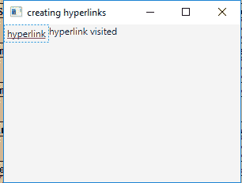
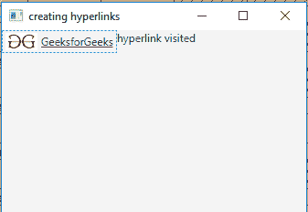

# JavaFX |超链接类

> 原文:[https://www.geeksforgeeks.org/javafx-hyperlink-class/](https://www.geeksforgeeks.org/javafx-hyperlink-class/)

超链接类是 JavaFX 的一部分。超链接是一种 HTML 类型的标签，可以包含文本和/或图形。它响应翻转和点击。当点击/按下超链接时*变为真。超链接的行为类似于按钮。按下并释放超链接时，会发送*行动事件*。因此您的应用程序可以基于此事件执行一些操作。*

**类的构造函数:**

1.  **超链接()**:创建没有文本或图形的超链接。
2.  **超链接(字符串 t)** :创建一个以指定文本为标签的超链接。
3.  **超链接(字符串 t，节点 g)** :创建一个以指定文本和图形为标签的超链接。

**常用方法:**

| 方法 | 说明 |
| --- | --- |
| isVisited() | 如果尚未访问超链接，则返回 true 否则返回 false。 |
| 集合访问(布尔 v) | 设置所访问属性的值。 |
| setonaction(事件处理程序 v) | 设置 onAction 属性的值。 |
| 火灾() | 如果定义了 ActionEvent，则实现为调用该 ActionEvent。 |

下面的程序说明了超链接类的使用:

1.  **Java Program to create a hyperlink and add it to the stage also add an event handler to handle the events:** This program creates a Hyperlink indicated by the name hyperlink. The Hyperlink will be created inside a scene, which in turn will be hosted inside a stage. We would create a label to show if the hyperlink is visited or not. The function *setTitle()* is used to provide title to the stage. Then an *HBox* is created, on which *addChildren()* method is called to attach the hyperlink and label inside the scene. Finally, the *show()* method is called to display the final results. We would create an event handler to handle the button events. The event handler would be added to the hyperlink using *setOnAction()* function.

    ```java
    // Java Program to create a hyperlink and add
    // it to the stage also add an event handler
    // to handle the events
    import javafx.application.Application;
    import javafx.scene.Scene;
    import javafx.scene.control.*;
    import javafx.scene.layout.*;
    import javafx.stage.Stage;
    import javafx.event.ActionEvent;
    import javafx.event.EventHandler;

    public class hyperlink extends Application {

        // launch the application
        public void start(Stage stage)
        {

            // set title for the stage
            stage.setTitle("creating hyperlinks");

            // create a hyperlink
            Hyperlink hyperlink = new Hyperlink("hyperlink");

            // create a HBox
            HBox hbox = new HBox();

            // create a label
            Label label = new Label("hyperlink not visited");

            // action event
            EventHandler<ActionEvent> event = 
            new EventHandler<ActionEvent>() {

                public void handle(ActionEvent e)
                {
                    label.setText("hyperlink visited ");
                }
            };

            // when hyperlink is pressed
            hyperlink.setOnAction(event);

            // add hyperlink
            hbox.getChildren().add(hyperlink);
            hbox.getChildren().add(label);

            // create a scene
            Scene scene = new Scene(hbox, 200, 200);

            // set the scene
            stage.setScene(scene);

            stage.show();
        }

        // Main Method
        public static void main(String args[])
        {

            // launch the application
            launch(args);
        }
    }
    ```

    **输出:**

    

2.  **Java Program to create a hyperlink with both text and image on it and also add an event handler to it:** This program creates a Hyperlink indicated by the name *hyperlink* with an image and text on it. The image will be included using the File Input Stream that imports the image. Then we will create an image using the object of the file input stream and then create an image view using the image file. The Hyperlink will be created inside a scene, which in turn will be hosted inside a stage. We would create a label to show if the hyperlink is visited or not. The function *setTitle()* is used to provide title to the stage. Then an *HBox* is created, on which *addChildren()* method is called to attach the hyperlink and label inside the scene. Finally, the *show()* method is called to display the final results. We would create an event handler to handle the button events. The event handler would be added to the hyperlink using *setOnAction()* function.

    ```java
    // Java Program to create a hyperlink with 
    // both text and image on it and also add 
    // an event handler to it
    import javafx.application.Application;
    import javafx.scene.Scene;
    import javafx.scene.control.*;
    import javafx.scene.layout.*;
    import javafx.stage.Stage;
    import javafx.event.ActionEvent;
    import javafx.event.EventHandler;
    import java.io.*;
    import javafx.scene.image.*;

    public class hyperlink_1 extends Application {

        // launch the application
        public void start(Stage stage)
        {

            try {

                // set title for the stage
                stage.setTitle("creating hyperlinks");

                // create a input stream
                FileInputStream input = new FileInputStream("f:\\gfg.png");

                // create a image
                Image image = new Image(input);

                // create a image View
                ImageView imageview = new ImageView(image);

                // create a hyperlink
                Hyperlink hyperlink = new Hyperlink("GeeksforGeeks", imageview);

                // create a HBox
                HBox hbox = new HBox();

                // create a label
                Label label = new Label("hyperlink not visited");

                // action event
                EventHandler<ActionEvent> event =
                 new EventHandler<ActionEvent>() {

                    public void handle(ActionEvent e)
                    {
                        label.setText("hyperlink visited ");
                    }
                };

                // when hyperlink is pressed
                hyperlink.setOnAction(event);

                // add hyperlink
                hbox.getChildren().add(hyperlink);
                hbox.getChildren().add(label);

                // create a scene
                Scene scene = new Scene(hbox, 200, 200);

                // set the scene
                stage.setScene(scene);

                stage.show();
            }

            catch (Exception e) {
                System.err.println(e.getMessage());
            }
        }

        // Main Method
        public static void main(String args[])
        {

            // launch the application
            launch(args);
        }
    }
    ```

    **输出:**

    

    **注意:**上述程序可能无法在在线 IDE 中运行。请使用离线编译器。

    **参考:**[https://docs . Oracle . com/javase/8/JavaFX/API/JavaFX/scene/control/hyperlink . html](https://docs.oracle.com/javase/8/javafx/api/javafx/scene/control/Hyperlink.html)