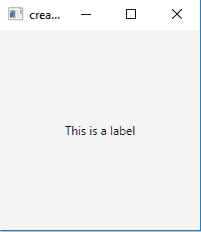
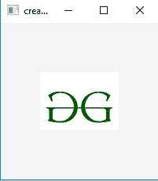
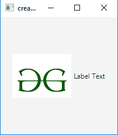
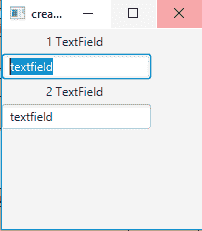
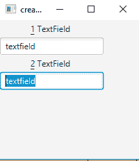

# JavaFX |标签

> 原文:[https://www.geeksforgeeks.org/javafx-label/](https://www.geeksforgeeks.org/javafx-label/)

标签是 JavaFX 包的一部分。标签用于显示短文本或图像，它是一个不可编辑的文本控件。这对于显示需要适合特定空间的文本非常有用，因此可能需要使用省略号或截断来调整字符串的大小。标签也很有用，因为它们可以有助记符，如果使用助记符，会将焦点发送到列为标签或属性目标的控件。标签只能显示文本或图像，无法获得焦点。
**标签类的构造函数为** :

1.  **标签()**:创建一个空标签
2.  **标签(字符串 t)** :用给定的文本创建标签。
3.  **标签(字符串 t，节点 g)** :用给定的文本和图形创建标签。

**常用方法**:

<figure class="table">

| 方法 | 说明 |
| --- | --- |
| **createDefaultSkin()** | 为此控件创建默认外观的新实例。 |
| **山羊标签符()** | 获取 labelFor 属性的值。 |
| **labelForProperty()** | 标签可以作为不同控件或节点的标签。 |
| **设置标签页(节点五)** | 设置标签或属性的值。 |

</figure>

以下程序说明了标签的使用:

1.  **程序 1** :该程序创建一个由名称 *b* 表示的标签。进度指示器将在场景中创建，而场景又将托管在舞台(顶级 JavaFX 容器)中。函数 setTitle()用于为舞台提供标题。然后创建一个堆栈窗格，在该窗格上调用 addChildren()方法将标签与代码中的(200，200)指定的分辨率一起附加到场景中。最后调用 show()方法显示最终结果。

## Java 语言(一种计算机语言，尤用于创建网站)

```
// Java program to create a label
import javafx.application.Application;
import javafx.scene.Scene;
import javafx.scene.control.*;
import javafx.scene.layout.*;
import javafx.event.ActionEvent;
import javafx.event.EventHandler;
import javafx.scene.control.Label;
import javafx.stage.Stage;
public class label extends Application {

    // launch the application
    public void start(Stage s)
    {
        // set title for the stage
        s.setTitle("creating label");

        // create a label
        Label b = new Label("This is a label");

        // create a Stack pane
        StackPane r = new StackPane();

        // add password field
        r.getChildren().add(b);

        // create a scene
        Scene sc = new Scene(r, 200, 200);

        // set the scene
        s.setScene(sc);

        s.show();
    }

    public static void main(String args[])
    {
        // launch the application
        launch(args);
    }
}
```

1.  **输出** :



1.  **用图像创建标签的 Java 程序**:该程序用名称 *b* 表示的图像创建标签，图像名为 *i* ，图像视图名为 *iw* 。标签将在场景中创建，场景又将托管在舞台(顶级 JavaFX 容器)中。函数 setTitle()用于为舞台提供标题。然后创建一个堆栈窗格，在该窗格上调用 addChildren()方法来附加带有场景内图像的标签，以及由代码中的(200，200)指定的分辨率。最后调用 show()方法显示最终结果。

## Java 语言(一种计算机语言，尤用于创建网站)

```
// Java program to create a label with images
import javafx.application.Application;
import javafx.scene.Scene;
import javafx.scene.control.*;
import javafx.scene.layout.*;
import javafx.event.ActionEvent;
import javafx.event.EventHandler;
import javafx.scene.control.Label;
import javafx.stage.Stage;
import javafx.scene.image.*;
import java.io.*;
public class label_1 extends Application {

    // launch the application
    public void start(Stage s) throws Exception
    {
        // set title for the stage
        s.setTitle("creating label");

        // create a input stream
        FileInputStream input = new FileInputStream("f:\\gfg.png");

        // create a image
        Image i = new Image(input);

        // create a image View
        ImageView iw = new ImageView(i);

        // create a label
        Label b = new Label("", iw);

        // create a Stack pane
        StackPane r = new StackPane();

        // add password field
        r.getChildren().add(b);

        // create a scene
        Scene sc = new Scene(r, 200, 200);

        // set the scene
        s.setScene(sc);

        s.show();
    }

    public static void main(String args[])
    {
        // launch the application
        launch(args);
    }
}
```

1.  **输出** :



1.  **Java 程序创建带有图像和文本的标签**:该程序创建带有图像和文本的标签，名称为 *b* ，图像名为 *i* ，图像视图名为 *iw* 。要在标签上显示的文本被作为参数传递给标签的构造函数。标签将在场景中创建，场景又将托管在舞台(顶级 JavaFX 容器)中。函数 setTitle()用于为舞台提供标题。然后创建一个堆栈窗格，在该窗格上调用 addChildren()方法来附加带有场景内图像的标签，以及由代码中的(200，200)指定的分辨率。最后调用 show()方法显示最终结果。

## Java 语言(一种计算机语言，尤用于创建网站)

```
// Java program to create a label with images and text
import javafx.application.Application;
import javafx.scene.Scene;
import javafx.scene.control.*;
import javafx.scene.layout.*;
import javafx.event.ActionEvent;
import javafx.event.EventHandler;
import javafx.scene.control.Label;
import javafx.stage.Stage;
import javafx.scene.image.*;
import java.io.*;
public class label_2 extends Application {

    // launch the application
    public void start(Stage s) throws Exception
    {
        // set title for the stage
        s.setTitle("creating label");

        // create a input stream
        FileInputStream input = new FileInputStream("f:\\gfg.png");

        // create a image
        Image i = new Image(input);

        // create a image View
        ImageView iw = new ImageView(i);

        // create a label
        Label b = new Label("Label Text", iw);

        // create a Stack pane
        StackPane r = new StackPane();

        // add password field
        r.getChildren().add(b);

        // create a scene
        Scene sc = new Scene(r, 200, 200);

        // set the scene
        s.setScene(sc);

        s.show();
    }

    public static void main(String args[])
    {
        // launch the application
        launch(args);
    }
}
```

1.  **输出** :



1.  **Java 程序创建一个标签和文本字段，并使用 setLabelFor 属性**:在这个程序中，标签被设置为助记符解析(如果按下 Alt+1，则焦点转移到第一个文本字段，如果按下 Alt + 2，则焦点转移到第二个文本字段。

## Java 语言(一种计算机语言，尤用于创建网站)

```
// Java program to create a labels and textfield and use setLabelFor property
import javafx.application.Application;
import javafx.scene.Scene;
import javafx.scene.control.*;
import javafx.scene.layout.*;
import javafx.event.ActionEvent;
import javafx.event.EventHandler;
import javafx.scene.control.Label;
import javafx.stage.Stage;
import javafx.scene.image.*;
import java.io.*;
public class label_3 extends Application {

    // launch the application
    public void start(Stage s) throws Exception
    {
        // set title for the stage
        s.setTitle("creating label");

        // TextField
        TextField b1 = new TextField("textfield");

        // create a label
        Label b = new Label("_1 TextField");

        // setlabel for
        b.setLabelFor(b1);

        // TextField
        TextField b4 = new TextField("textfield");

        // create a label
        Label b3 = new Label("_2 TextField");

        // setlabel for
        b3.setLabelFor(b4);

        // create a Tile pane
        TilePane r = new TilePane();

        // setMnemonic
        b.setMnemonicParsing(true);
        b3.setMnemonicParsing(true);

        // add password field
        r.getChildren().add(b);
        r.getChildren().add(b1);
        r.getChildren().add(b3);
        r.getChildren().add(b4);

        // create a scene
        Scene sc = new Scene(r, 200, 200);

        // set the scene
        s.setScene(sc);

        s.show();
    }

    public static void main(String args[])
    {
        // launch the application
        launch(args);
    }
}
```

1.  **输出** :





**注意**:以下程序可能无法在联机 IDE 中运行，请使用脱机编译器。你应该有最新版本的 Java 来运行这些程序。
**参考**:[https://docs . Oracle . com/javase/8/JavaFX/API/JavaFX/scene/control/label . html](https://docs.oracle.com/javase/8/javafx/api/javafx/scene/control/Label.html)