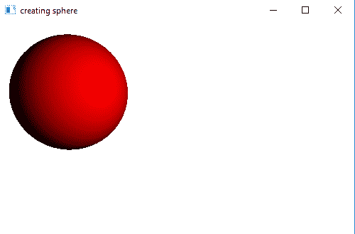

# JavaFX | PointLight 带示例

> 原文:[https://www . geesforgeks . org/JavaFX-point light-with-examples/](https://www.geeksforgeeks.org/javafx-pointlight-with-examples/)

PointLight 是 JavaFX 的一部分。点光源定义了一个点光源。点光源是空间中的固定光源，向各个方向辐射光线。

**该类的构造函数为:**

1.  **点光源()**:创建点光源的新实例
2.  **点光源(颜色 c)** :创建特定颜色的点光源的新实例

**常用方法:**

| 方法 | 说明 |
| --- | --- |
| 获得颜色 （） | 返回光线的颜色 |
| isLightOn() | 返回灯是否亮着 |
| 设置颜色(颜色值) | 设置灯光的颜色 |
| setLightOn(布尔值) | 设置 lightOn 属性的值。 |

下面的程序说明了点光源类:

1.  **Java program to create a point light of default color:** This program creates a Sphere indicated by the name sphere(radius is passed as arguments). A PointLight is created named pointlight which is a point light source and radiates light in all direction. The Sphere will be created inside a scene, which in turn will be hosted inside a stage. The function setTitle() is used to provide title to the stage. Then a Group is created, and the sphere and pointlight are attached. The group is attached to the scene. Finally, the *show()* method is called to display the final results. A perspective camera will be created and added to the scene to render the cylinder in 3D.

    ```
    // Java program to create a point light of default color
    import javafx.application.Application;
    import javafx.scene.Scene;
    import javafx.scene.shape.DrawMode;
    import javafx.scene.layout.*;
    import javafx.event.ActionEvent;
    import javafx.scene.PointLight;
    import javafx.scene.shape.Sphere;
    import javafx.scene.control.*;
    import javafx.stage.Stage;
    import javafx.scene.Group;
    import javafx.scene.PerspectiveCamera;
    import javafx.scene.paint.Color;

    public class pointlight_2 extends Application {

        // launch the application
        public void start(Stage stage)
        {

            // set title for the stage
            stage.setTitle("creating sphere");

            // create a sphere
            Sphere sphere = new Sphere(80.0f);

            // create a point light
            PointLight pointlight = new PointLight();

            // create a Group
            Group group = new Group(sphere, pointlight);

            // translate the sphere to a position
            sphere.setTranslateX(100);
            sphere.setTranslateY(100);

            // translate point light
            pointlight.setTranslateZ(-1000);
            pointlight.setTranslateX(+1000);
            pointlight.setTranslateY(+10);

            // create a perspective camera
            PerspectiveCamera camera = new PerspectiveCamera(false);
            camera.setTranslateX(0);
            camera.setTranslateY(0);
            camera.setTranslateZ(0);

            // create a scene
            Scene scene = new Scene(group, 500, 300);

            scene.setCamera(camera);

            // set the scene
            stage.setScene(scene);

            stage.show();
        }

        // Main Method
        public static void main(String args[])
        {

            // launch the application
            launch(args);
        }
    }
    ```

    **输出:**

    

2.  **Java program to create a point light of a specified color(e.g. RED):** This program creates a Sphere indicated by the name sphere( radius is passed as arguments). A PointLight is created named pointlight( with a specified color passed as an argument which is a point light source and radiates light in all direction. The Sphere will be created inside a scene, which in turn will be hosted inside a stage. The function *setTitle()* is used to provide title to the stage. Then a Group is created, and the sphere and pointlight are attached. The group is attached to the scene. Finally, the *show()* method is called to display the final results. A perspective camera will be created and added to the scene to render the cylinder in 3D.

    ```
    // Java program to create a point light
    // of specified color(eg RED)
    import javafx.application.Application;
    import javafx.scene.Scene;
    import javafx.scene.shape.DrawMode;
    import javafx.scene.layout.*;
    import javafx.event.ActionEvent;
    import javafx.scene.PointLight;
    import javafx.scene.shape.Sphere;
    import javafx.scene.control.*;
    import javafx.stage.Stage;
    import javafx.scene.Group;
    import javafx.scene.PerspectiveCamera;
    import javafx.scene.paint.Color;

    public class sphere_1 extends Application {

        // launch the application
        public void start(Stage stage)
        {

            // set title for the stage
            stage.setTitle("creating sphere");

            // create a sphere
            Sphere sphere = new Sphere(80.0f);

            // create a point light
            PointLight pointlight = new PointLight(Color.RED);

            // create a Group
            Group group = new Group(sphere, pointlight);

            // translate the sphere to a position
            sphere.setTranslateX(100);
            sphere.setTranslateY(100);

            // translate point light
            pointlight.setTranslateZ(-1000);
            pointlight.setTranslateX(+1000);
            pointlight.setTranslateY(+10);

            // create a perspective camera
            PerspectiveCamera camera = new PerspectiveCamera(false);
            camera.setTranslateX(0);
            camera.setTranslateY(0);
            camera.setTranslateZ(0);

            // create a scene
            Scene scene = new Scene(group, 500, 300);

            scene.setCamera(camera);

            // set the scene
            stage.setScene(scene);

            stage.show();
        }

        // Main Method
        public static void main(String args[])
        {

            // launch the application
            launch(args);
        }
    }
    ```

    **输出:**
    [](https://media.geeksforgeeks.org/wp-content/uploads/sphere_2.png)

**注意:**上述程序可能无法在在线 IDE 中运行。请使用离线编译器。

**参考:**[https://docs . Oracle . com/javase/8/JavaFX/API/JavaFX/scene/pointlight . html](https://docs.oracle.com/javase/8/javafx/api/javafx/scene/PointLight.html)