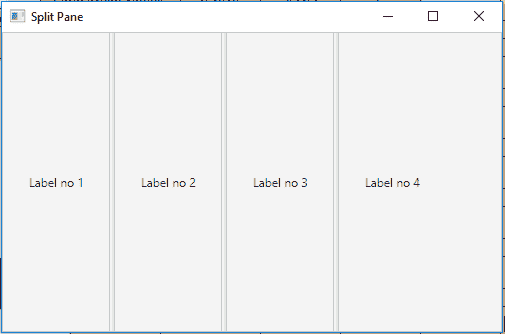
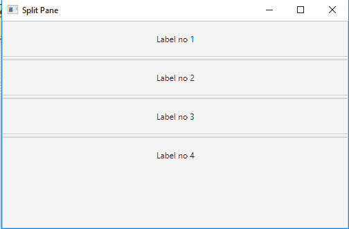

# JavaFX | SplitPane 类

> 原文:[https://www.geeksforgeeks.org/javafx-splitpane-class/](https://www.geeksforgeeks.org/javafx-splitpane-class/)

SplitPane 类是 JavaFX 的一部分。SplitPane 类是一个包含两个或多个由分隔符分隔的边的控件。用户可以拖动两侧，以给一侧更多的空间，从而使另一侧收缩相同的量。SplitPane 类继承*控件*类。

**类别的构造者:**

*   **分割窗格()**:创建新的分割窗格。
*   **分割窗格(节点… n)** :创建具有指定节点的分割窗格。

**常用方法:**

| 方法 | 说明 |
| --- | --- |
| getItems（） | 返回拆分窗格的项目。 |
| getOrientation() | 返回拆分窗格的方向。 |
| setdividerdposition(int dividerdindex，双位置) | 设置分隔线在指定索引处的位置。 |
| set dividends(双... p) | 设置分隔线的位置。 |
| 设置方向(方向 o) | 设置 splitpane 的 orienattion。 |

下面的程序说明了 SplitPane 类的使用:

1.  **Java program to create a split pane and add labels to it:**
    *   在这个程序中，我们将创建一个 SplitPane 名称 *split_pane* 。
    *   使用 *getItems()创建标签并将其添加到拆分窗格。add()* 功能。
    *   将 *split_pane* 添加到场景中，并将场景添加到舞台中。
    *   调用 *show()* 功能显示最终结果。

    ```java
    // Java program to create a split pane
    // and add labels to it
    import javafx.application.Application;
    import javafx.scene.Scene;
    import javafx.scene.control.*;
    import javafx.scene.layout.*;
    import javafx.stage.Stage;
    import javafx.scene.layout.*;
    import javafx.scene.paint.*;
    import javafx.scene.text.*;
    import javafx.geometry.*;
    import javafx.scene.layout.*;
    import javafx.scene.shape.*;
    import javafx.scene.paint.*;
    import javafx.scene.*;
    import java.io.*;
    import javafx.scene.image.*;

    public class SplitPane_1 extends Application {

        // launch the application
        public void start(Stage stage)
        {

            try {

                // set title for the stage
                stage.setTitle("Split Pane");

                // create a splitpane
                SplitPane split_pane = new SplitPane();

                // create labels and add it to splitPane
                for (int i = 1; i < 5; i++) {

                    split_pane.getItems().add(new Label("\tLabel no " 
                                                        + i + "\t"));
                }

                // create a scene
                Scene scene = new Scene(split_pane, 500, 300);

                // set the scene
                stage.setScene(scene);

                stage.show();
            }

            catch (Exception e) {

                System.out.println(e.getMessage());
            }
        }

        // Main Method
        public static void main(String args[])
        {

            // launch the application
            launch(args);
        }
    }
    ```

    **输出:**

    

2.  **Java program to create a split pane set its orientation and add labels to it:**
    *   在这个程序中，我们将创建一个分割面板名称*分割面板*。
    *   使用 *getItems()创建标签并将其添加到拆分窗格。add()* 功能。
    *   将 *split_pane* 添加到场景中，并将场景添加到舞台中。
    *   使用*设置方向()*功能设置*分割窗格*的方向。
    *   调用 *show()* 功能显示最终结果。

    ```java
    // Java program to create a split pane, set
    // its orientation and add labels to it
    import javafx.application.Application;
    import javafx.scene.Scene;
    import javafx.scene.control.*;
    import javafx.scene.layout.*;
    import javafx.stage.Stage;
    import javafx.scene.layout.*;
    import javafx.scene.paint.*;
    import javafx.scene.text.*;
    import javafx.geometry.*;
    import javafx.scene.layout.*;
    import javafx.scene.shape.*;
    import javafx.scene.paint.*;
    import javafx.scene.*;
    import java.io.*;
    import javafx.scene.image.*;

    public class SplitPane_2 extends Application {

        // launch the application
        public void start(Stage stage)
        {

            try {

                // set title for the stage
                stage.setTitle("Split Pane");

                // create a splitpane
                SplitPane split_pane = new SplitPane();

                // create labels and add it to splitPane
                for (int i = 1; i < 5; i++) {

                    // create a label
                    Label label = new Label("\tLabel no " + i + "\t");

                    // set preferred height
                    label.setPrefHeight(50);

                    split_pane.getItems().add(label);
                }

                // set Orientation of splitpane
                split_pane.setOrientation(Orientation.VERTICAL);

                // create a scene
                Scene scene = new Scene(split_pane, 500, 300);

                // set the scene
                stage.setScene(scene);

                stage.show();
            }

            catch (Exception e) {

                System.out.println(e.getMessage());
            }
        }

        // Main Method
        public static void main(String args[])
        {

            // launch the application
            launch(args);
        }
    }
    ```

    **输出:**

    

**注意:**上述程序可能无法在联机 IDE 中运行，请使用脱机编译器。

**参考:**[https://docs . Oracle . com/javase/8/JavaFX/API/JavaFX/scene/control/splitpane . html](https://docs.oracle.com/javase/8/javafx/api/javafx/scene/control/SplitPane.html)