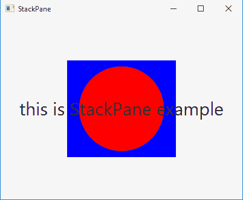
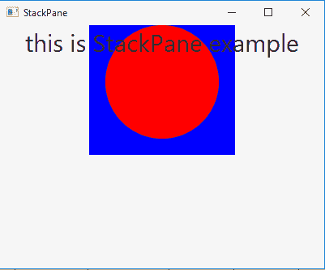

# JavaFX | StackPane 类

> 原文:[https://www.geeksforgeeks.org/javafx-stackpane-class/](https://www.geeksforgeeks.org/javafx-stackpane-class/)

StackPane 类是 JavaFX 的一部分。StackPane 类以堆栈的形式布局其子类。新节点被放置在堆栈中前一个节点的顶部。StackPane 类继承 *[窗格类](https://www.geeksforgeeks.org/javafx-pane-class/)* 。

**类的构造函数:**

1.  **堆叠面板()**:创建一个新的空堆叠面板。
2.  **堆叠面板(节点… c)** :用指定的节点创建新的堆叠面板。

**常用方法:**

| 方法 | 说明 |
| --- | --- |
| getAlignment() | 返回堆栈的对齐方式。 |
| 对齐(节点 c) | 返回节点的对齐方式。 |
| 获取边距(节点 c) | 返回节点的 insets。 |
| 设置对齐(节点 n，位置 v) | 设置作为堆栈平面一部分的节点的对齐方式。 |
| 设置对齐(位置 v) | 设置堆栈的对齐方式。 |
| setMargin（Node n， Insets v） | 设置作为堆栈平面一部分的节点的边距。 |

下面的程序说明了 StackPane 类的使用:

1.  **Java Program to create a StackPane, add circle, label, rectangle and add it to the stage:** In this program we are creating a Label named *label*, a Rectangle named *rectangle* and a Circle named *circle*. Then set the font of the StackPane using the *setFont()* function. Now set the fill of the rectangle and circle using the *setFill()* function. We will then create a StackPane named *stack_pane* and add rectangle, circle and label. Create a scene and add the stack_pane to the scene. Add this scene to the stage and call the *show()* function to display the final results.

    ```java
    // Java Program to create a StackPane,
    // add circle, label, rectangle
    // and add it to the stage
    import javafx.application.Application;
    import javafx.scene.Scene;
    import javafx.scene.control.*;
    import javafx.scene.layout.*;
    import javafx.stage.Stage;
    import javafx.event.ActionEvent;
    import javafx.scene.paint.*;
    import javafx.scene.canvas.*;
    import javafx.scene.text.*;
    import javafx.scene.Group;
    import javafx.scene.shape.*;

    public class StackPane_1 extends Application {

        // launch the application
        public void start(Stage stage)
        {

            try {

                // set title for the stage
                stage.setTitle("StackPane");

                // create a label
                Label label = new Label("this is StackPane example");

                // set Font for label
                label.setFont(new Font(30));

                // create a circle
                Circle circle = new Circle(100, 100, 70);

                // set fill for  the circle
                circle.setFill(Color.RED);

                // create Rectangle
                Rectangle rectangle = new Rectangle(100, 100, 180, 160);

                // set fill for rectangle
                rectangle.setFill(Color.BLUE);

                // create a stack pane
                StackPane stack_pane = new StackPane(rectangle, circle, label);

                // create a scene
                Scene scene = new Scene(stack_pane, 400, 300);

                // set the scene
                stage.setScene(scene);

                stage.show();
            }

            catch (Exception e) {

                System.out.println(e.getMessage());
            }
        }

        // Main Method
        public static void main(String args[])
        {

            // launch the application
            launch(args);
        }
    }
    ```

    **输出:**

    

2.  **Java Program to create a StackPane, add the circle, label, rectangle and then set the alignment of the StackPane and add it to the stage:** In this program we are creating a Label named *label*, a Rectangle named *rectangle* and a Circle named *circle*. Then set the font of the StackPane using the *setFont()* function. Set fill of the rectangle and circle using the *setFill()* function. Now create a StackPane named *stack_pane* and add rectangle, circle, and label. Set the alignment of the stack_pane using *setAlignment()* function. Create a scene and add the stack_pane to the scene. Finally add this scene to the stage and call the *show()* function to display the results.

    ```java
    // Java Program to create a StackPane, 
    // add the circle, label, rectangle and
    // then set the alignment of the StackPane
    // and add it to the stage
    import javafx.application.Application;
    import javafx.scene.Scene;
    import javafx.scene.control.*;
    import javafx.scene.layout.*;
    import javafx.stage.Stage;
    import javafx.geometry.*;
    import javafx.scene.paint.*;
    import javafx.scene.canvas.*;
    import javafx.scene.text.*;
    import javafx.scene.Group;
    import javafx.scene.shape.*;

    public class StackPane_2 extends Application {

        // launch the application
        public void start(Stage stage)
        {

            try {

                // set title for the stage
                stage.setTitle("StackPane");

                // create a label
                Label label = new Label("this is StackPane example");

                // set Font for label
                label.setFont(new Font(30));

                // create a circle
                Circle circle = new Circle(100, 100, 70);

                // set fill for  the circle
                circle.setFill(Color.RED);

                // create Rectangle
                Rectangle rectangle = new Rectangle(100, 100, 180, 160);

                // set fill for rectangle
                rectangle.setFill(Color.BLUE);

                // create a stack pane
                StackPane stack_pane = new StackPane(rectangle, circle, label);

                // set alignement for the stack pane
                stack_pane.setAlignment(Pos.TOP_CENTER);

                // create a scene
                Scene scene = new Scene(stack_pane, 400, 300);

                // set the scene
                stage.setScene(scene);

                stage.show();
            }

            catch (Exception e) {

                System.out.println(e.getMessage());
            }
        }

        // Main Method
        public static void main(String args[])
        {

            // launch the application
            launch(args);
        }
    }
    ```

    **输出:**

    

    **注意:**上述程序可能无法在联机 IDE 中运行，请使用脱机编译器。

    **参考:**[https://docs . Oracle . com/javase/8/JavaFX/API/JavaFX/scene/layout/stack pane . html](https://docs.oracle.com/javase/8/javafx/api/javafx/scene/layout/StackPane.html)