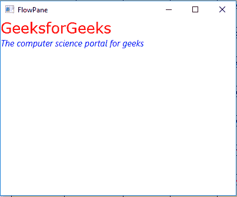

# JavaFX | TextFlow 类

> 原文:[https://www.geeksforgeeks.org/javafx-textflow-class/](https://www.geeksforgeeks.org/javafx-textflow-class/)

TextFlow 类是 JavaFX 的一部分。TextFlow 类旨在布局富文本。它可用于在单个文本流中布局多个文本节点。TextFlow 类扩展了 [*窗格*](https://www.geeksforgeeks.org/javafx-pane-class/) 类。

**类的构造函数:**

1.  **TextFlow()** :新建一个 TextFlow 对象。
2.  **TextFlow(Node… c)** :用指定的节点创建一个新的 TextFlow 对象。

**常用方法:**

| 方法 | 说明 |
| --- | --- |
| getLineSpacing() | 返回文本流的行距 |
| getTextAlignment() | 返回文本流的文本对齐方式 |
| 设置行间距(双 s) | 设置文本流的行距。 |
| 设置对齐(文本对齐 v) | 设置文本流的文本对齐方式。 |

下面的程序说明了文本流类的使用:

1.  **Java program to create a TextFlow and add text object to it:** In this program we will create a TextFlow named *text_flow* and two Text named *text_1* and *text_2*. Set the fill and font using *setFill()* and *setFont()*. We will add the text to the *text_flow* using the *getChildren().add()* function. Add the *text_flow* to the scene and scene to the stage. Call the *show()* function to display the final results.

    ```java
    // Java program to create a TextFlow and 
    // add text object to it .
    import javafx.application.Application;
    import javafx.scene.Scene;
    import javafx.scene.control.*;
    import javafx.scene.layout.*;
    import javafx.stage.Stage;
    import javafx.event.ActionEvent;
    import javafx.scene.paint.*;
    import javafx.scene.text.*;
    import javafx.scene.web.*;
    import javafx.scene.layout.*;
    import javafx.scene.shape.*;

    public class TextFlow_0 extends Application {

        // launch the application
        public void start(Stage stage)
        {

            try {

                // set title for the stage
                stage.setTitle("TextFlow");

                // create TextFlow
                TextFlow text_flow = new TextFlow();

                // create text
                Text text_1 = new Text("GeeksforGeeks\n");

                // set the text color
                text_1.setFill(Color.RED);

                // set font of the text
                text_1.setFont(Font.font("Verdana", 25));

                // create text
                Text text_2 = new Text("The computer science portal for geeks");

                // set the text color
                text_2.setFill(Color.BLUE);

                // set font of the text
                text_2.setFont(Font.font("Helvetica", FontPosture.ITALIC, 15));

                // add text to textflow
                text_flow.getChildren().add(text_1);
                text_flow.getChildren().add(text_2);

                // create a scene
                Scene scene = new Scene(text_flow, 400, 300);

                // set the scene
                stage.setScene(scene);

                stage.show();
            }

            catch (Exception e) {

                System.out.println(e.getMessage());
            }
        }

        // Main Method
        public static void main(String args[])
        {

            // launch the application
            launch(args);
        }
    }
    ```

    **输出:**

    

2.  **Java program to create a TextFlow and add text object to it, set text Alignment and set line spacing of the text flow:** In this program we will create a TextFlow named *text_flow* and two Text named *text_1* and *text_2*. Set the fill and font using *setFill()* and *setFont()*. Set TextAlignment using *setTextAlignment()* and set the line spacing using the *setLineSpacing()* function. Add the text to the *text_flow* using the *getChildren().add()* function. Add the *text_flow* to the Vbox. Add the vbox scene and the scene to the stage. Call the *show()* function to display the final results.

    ```java
    // Java program to create a TextFlow and 
    // add text object to it, set text Alignment
    // and set line spacing of the text flow.
    import javafx.application.Application;
    import javafx.scene.Scene;
    import javafx.scene.control.*;
    import javafx.scene.layout.*;
    import javafx.stage.Stage;
    import javafx.scene.layout.*;
    import javafx.scene.paint.*;
    import javafx.scene.text.*;
    import javafx.geometry.*;
    import javafx.scene.layout.*;
    import javafx.scene.shape.*;

    public class TextFlow_1 extends Application {

        // launch the application
        public void start(Stage stage)
        {

            try {

                // set title for the stage
                stage.setTitle("FlowPane");

                // create TextFlow
                TextFlow text_flow = new TextFlow();

                // create text
                Text text_1 = new Text("GeeksforGeeks\n");

                // set the text color
                text_1.setFill(Color.GREEN);

                // set font of the text
                text_1.setFont(Font.font("Verdana", 25));

                // create text
                Text text_2 = new Text("The computer science portal for geeks");

                // set the text color
                text_2.setFill(Color.BLUE);

                // set font of the text
                text_2.setFont(Font.font("Helvetica", FontPosture.ITALIC, 15));

                // add text to textflow
                text_flow.getChildren().add(text_1);
                text_flow.getChildren().add(text_2);

                // set text Alignment
                text_flow.setTextAlignment(TextAlignment.CENTER);

                // set line spacing
                text_flow.setLineSpacing(20.0f);

                // create VBox
                VBox vbox = new VBox(text_flow);

                // set alignment of vbox
                vbox.setAlignment(Pos.CENTER);

                // create a scene
                Scene scene = new Scene(vbox, 400, 300);

                // set the scene
                stage.setScene(scene);

                stage.show();
            }

            catch (Exception e) {

                System.out.println(e.getMessage());
            }
        }

        // Main Method
        public static void main(String args[])
        {

            // launch the application
            launch(args);
        }
    }
    ```

    **输出:**

    

**注意:**上述程序可能无法在联机 IDE 中运行，请使用脱机编译器。

**参考:**[https://docs . Oracle . com/javase/8/JavaFX/API/JavaFX/scene/text/textflow . html](https://docs.oracle.com/javase/8/javafx/api/javafx/scene/text/TextFlow.html)