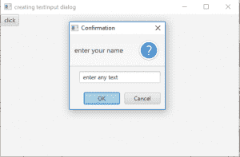
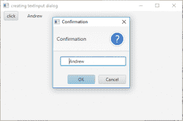

# javfx \ text input 对话框

> 原文:[https://www.geeksforgeeks.org/javafx-textinputdialog/](https://www.geeksforgeeks.org/javafx-textinputdialog/)

TextInputDialog 是 JavaFX 库的一部分。文本输入对话框是一个允许用户输入文本的对话框，该对话框包含标题文本、文本字段和确认按钮。

**TextInputDialog 类的构造函数为:**

1.  **TextInputDialog()** :创建没有初始文本的文本输入对话框。
2.  **TextInputDialog(String txt)**:用初始文本 *txt* 创建文本输入对话框。

**常用方法:**

| 方法 | 说明 |
| --- | --- |
| **getDefaultValue（）** | 返回文本输入对话框的默认值 |
| get editor() | 返回文本输入对话框的编辑器 |
| **setHeaderText(字符串 s)** | 设置文本输入对话框标题的标题文本 |

下面的程序说明了文本输入对话框类:

1.  **Program to create a TextInputDialog and add it to the stage:** This program creates a TextInputDialog with an initial text and a header text. The header text is set using setHeaderText() function. Button is indicated by the name *d* and text input dialog will have name *td*. The button will be created inside a scene, which in turn will be hosted inside a stage. The function setTitle() is used to provide title to the stage. Then a tile pane is created, on which addChildren() method is called to attach the button inside the scene. Finally, the show() method is called to display the final results. The TextInputDialog will be shown on the click of the button.

    ```java
    // Java Program to create a text input
    // dialog and add it to the stage
    import javafx.application.Application;
    import javafx.scene.Scene;
    import javafx.scene.control.Button;
    import javafx.scene.layout.*;
    import javafx.event.ActionEvent;
    import javafx.event.EventHandler;
    import javafx.scene.control.*;
    import javafx.stage.Stage;
    import javafx.scene.control.Alert.AlertType;
    import java.time.LocalDate;
    public class TextInputDialog_1 extends Application {

        // launch the application
        public void start(Stage s)
        {
            // set title for the stage
            s.setTitle("creating textInput dialog");

            // create a tile pane
            TilePane r = new TilePane();

            // create a text input dialog
            TextInputDialog td = new TextInputDialog("enter any text");

            // setHeaderText
            td.setHeaderText("enter your name");

            // create a button
            Button d = new Button("click");

            // create a event handler
            EventHandler<ActionEvent> event = new EventHandler<ActionEvent>() {
                public void handle(ActionEvent e)
                {
                    // show the text input dialog
                    td.show();
                }
            };

            // set on action of event
            d.setOnAction(event);

            // add button and label
            r.getChildren().add(d);

            // create a scene
            Scene sc = new Scene(r, 500, 300);

            // set the scene
            s.setScene(sc);

            s.show();
        }

        public static void main(String args[])
        {
            // launch the application
            launch(args);
        }
    }
    ```

    **输出:**
    

2.  **Program to create a TextInputDialog and add a label to display the text entered:** This program creates a TextInputDialog (*td*). Button indicated by the name *d* and TextInputDialog will have name *td*. The button will be created inside a scene, which in turn will be hosted inside a stage. The function setTitle() is used to provide title to the stage. Then a tile pane is created, on which addChildren() method is called to attach the button inside the scene. Finally, the show() method is called to display the final results.when the button will be clicked the text input dialog will be shown. A label named l will be created that will be added to the scene which will show the text that the user inputs in the dialog.

    ```java
    // Java Program to create a text input dialog
    // and add a label to display the text entered
    import javafx.application.Application;
    import javafx.scene.Scene;
    import javafx.scene.control.Button;
    import javafx.scene.layout.*;
    import javafx.event.ActionEvent;
    import javafx.event.EventHandler;
    import javafx.scene.control.*;
    import javafx.stage.Stage;
    import javafx.scene.control.Alert.AlertType;
    import java.time.LocalDate;
    public class TextInputDialog_2 extends Application {

        // launch the application
        public void start(Stage s)
        {
            // set title for the stage
            s.setTitle("creating textInput dialog");

            // create a tile pane
            TilePane r = new TilePane();

            // create a label to show the input in text dialog
            Label l = new Label("no text input");

            // create a text input dialog
            TextInputDialog td = new TextInputDialog();

            // create a button
            Button d = new Button("click");

            // create a event handler
            EventHandler<ActionEvent> event = new EventHandler<ActionEvent>() {
                public void handle(ActionEvent e)
                {
                    // show the text input dialog
                    td.showAndWait();

                    // set the text of the label
                    l.setText(td.getEditor().getText());
                }
            };

            // set on action of event
            d.setOnAction(event);

            // add button and label
            r.getChildren().add(d);
            r.getChildren().add(l);

            // create a scene
            Scene sc = new Scene(r, 500, 300);

            // set the scene
            s.setScene(sc);

            s.show();
        }

        public static void main(String args[])
        {
            // launch the application
            launch(args);
        }
    }
    ```

    **输出:**
    

    **注意:**上述程序可能无法在联机 IDE 中运行，请使用脱机 IDE。

    **参考:**[https://docs . Oracle . com/javase/8/JavaFX/API/JavaFX/scene/control/textinputdialog . html](https://docs.oracle.com/javase/8/javafx/api/javafx/scene/control/TextInputDialog.html)