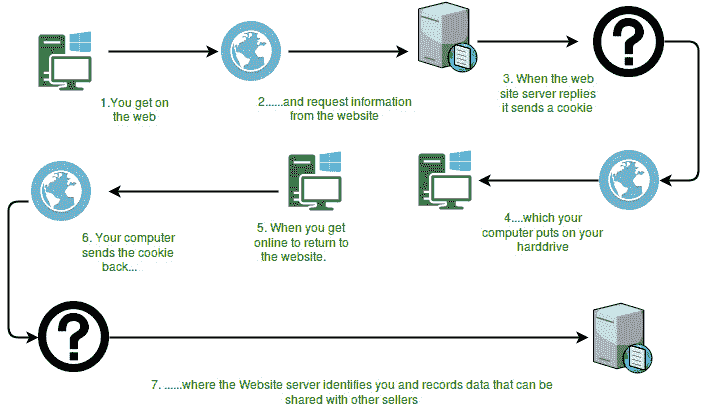

# Java 中的 Javax.servlet.http.Cookie 类

> 原文:[https://www . geesforgeks . org/javax-servlet-http-cookie-class-Java/](https://www.geeksforgeeks.org/javax-servlet-http-cookie-class-java/)

许多网站使用称为 cookies 的小字符串来存储连接之间的持久客户端状态。Cookies 在请求和响应的 HTTP 头中从服务器传递到客户端，然后再传递回来。服务器可以使用 Cookies 来指示会话标识、购物车内容、登录凭据、用户首选项等。

**饼干是如何工作的？**

[](https://media.geeksforgeeks.org/wp-content/uploads/beyond-cookies-in-mobile-advertising-5-638.jpg)

从上图可以看出，当用户第一次请求页面时，服务器和资源一起发送一个 cookie 对象存储在客户机上。该对象可能包含请求的详细信息。现在以后，如果用户再次请求相同的资源，它会随请求一起发送存储的 cookie，服务器可以使用它来进一步增强用户的体验。

**饼干的属性:**

*   **名称=值对:**这描述了存储在 cookie 中的实际信息。名称和值都不应包含空格或以下任何字符: **[ ] ( ) =，"/？@ : ;**
    **有效 cookie 名称-值对示例:** 

    ```
     Set-Cookie:session-id = 187-4969589-3049309
    ```

*   **域:**默认情况下，cookie 适用于它来自的服务器。如果 cookie 最初是由 www.foo.example.com 设置的，浏览器只会将 cookie 发送回 www.foo.example.com。但是，站点也可以指示 cookie 应用于整个子域，而不仅仅是原始服务器。例如，此请求为整个 foo.example.com 域设置了一个用户 cookie:
    浏览器不仅会将此 cookie 回显给 www.foo.example.com，还会回显给 lothar.foo.example.com、eliza.foo.example.com、enoch.foo.example.com 以及 foo.example.com 域中的任何其他主机。但是，服务器只能为其直接所属的域设置 cookies。www.foo.example.com 不能为 www.geeksforgeeks.org、example.com 或设置 cookie。不管它如何设置域名。

    ```
     Set-Cookie: user = geek ;Domain =.foo.example.com
    ```

*   **路径:**当从同一个服务器请求子树中的文档时，客户端会回显该 cookie。但是，它不使用网站上其他目录中的 cookie。

    ```
    Set-Cookie: user = geek; Path =/ restricted
    ```

*   **过期:**浏览器应该在过期后从缓存中删除 cookie。

    ```
     Set-Cookie: user = geek; expires = Wed, 21-Feb-2017 15:23:00 IST
    ```

*   **最大年龄:**该属性将 cookie 设置为在一定的秒数后过期，而不是在特定的时刻。例如，这个 cookie 在第一次设置后一小时(3600 秒)过期。

    ```
    Set-Cookie: user = "geek"; Max-Age = 3600
    ```

**构造函数**:用指定的名称-值对创建一个 cookie。

```
Syntax : public Cookie(String name, String value)
Parameters :
name : name of the cookie
value : value associated with this cookie

```

**方法:**

1.  **设置域():**设置该 cookie 可见的域。先前在 cookie 部分的属性中详细解释了域。

    ```
    Syntax : public void setDomain(String pattern)
    Parameters :
    pattern : string representing the domain in which this cookie is visible.
    ```

2.  **getDomain() :** 返回该 cookie 可见的域。

    ```
    Syntax : public String getDomain()
    ```

3.  **setComment() :** 指定此 cookie 的用途。

    ```
    Syntax : public void setComment(String purpose)
    Parameters :
    purpose : string representing the purpose of this cookie.
    ```

4.  **getComment()** :返回表示该 cookie 用途的字符串。

    ```
    Syntax : public String getComment()
    ```

5.  **setMaxAge() :** 指定此 cookie 过期前经过的时间(秒)。

    ```
    Syntax : public void setMaxAge(long time)
    Parameters :
    time : time in seconds before this cookie expires
    ```

6.  **getMaxAge() :** 返回该 cookie 的最大年龄部分。

    ```
    Syntax : public String getMaxAge()
    ```

7.  **setPath() :** 指定客户端应将 cookie 返回到的 cookie 路径。

    ```
    Syntax : public void setPath(String path)
    Parameters :
    path : path where this cookie is returned
    ```

8.  **getPath() :** 返回该 cookie 的路径组件。

    ```
    Syntax : public String getMaxAge()
    ```

9.  **设置安全():**指示发送此 cookie 时是否使用安全协议。默认值为假。

    ```
    Syntax : public void setSecure(boolean secure)
    Parameters:
    secure - If true, the cookie can only be sent over a secure
    protocol like https. 
    If false, it can be sent over any protocol.
    ```

10.  **getSecure() :** 如果该 cookie 必须是由安全协议发送的
    ，则返回 true，否则返回 false。

    ```
    Syntax : public boolean getSecure()
    ```

11.  **getName() :** 返回 cookie 的名称。

    ```
     Syntax : public String getName()
    ```

12.  **设置值():**初始化后为 cookie 分配新值。

    ```
    Syntax : public void setValue(String newValue)
    Parameters :
    newValue - a String specifying the new value
    ```

13.  **getValue :** 返回 cookie 的值。

    ```
    Syntax : public String getValue()
    ```

14.  **getVersion() :** 如果 cookie 符合原网景规范，则返回 0；1 如果饼干符合 RFC 2965/2109

    ```
    Syntax : public int getVersion()
    ```

15.  **setVersion() :** 用于设置该 cookie 使用的 cookie 协议版本。

    ```
    Syntax :public void setVersion(int v)
    Parameters :
    v - 0 for original Netscape specification; 1 for RFC 2965/2109

    ```

16.  **克隆():**返回该 cookie 的副本。

    ```
    Syntax : public Cookie clone()
    ```

下面是一个简单 servlet 程序的 Java 实现，当用户第一次请求时，它在浏览器中存储一个 cookie，然后对于进一步的请求，它显示存储的 cookie。

```
// Java program to illustrate methods
// of Cookie class
import java.io.IOException;
import java.io.PrintWriter;
import java.util.List;
import javax.servlet.ServletException;
import javax.servlet.annotation.WebServlet;
import javax.servlet.http.Cookie;
import javax.servlet.http.HttpServlet;
import javax.servlet.http.HttpServletRequest;
import javax.servlet.http.HttpServletResponse;

/**
 * Servlet implementation class cookieTest
 */
@WebServlet("/cookieTest")
public class cookieTest extends HttpServlet 
{
    private static final long serialVersionUID = 1L;

    /**
     * @see HttpServlet#HttpServlet()
     */
    public cookieTest() {
        super();
        // TODO Auto-generated constructor stub
    }

    /**
     * @see HttpServlet#doGet(HttpServletRequest request, HttpServletResponse
     *      response)
     */
    protected void doGet(HttpServletRequest request, HttpServletResponse response)
            throws ServletException, IOException 
    {

        response.setContentType("text/html");
        // Create a new cookie with the name test cookie
        // and value 123
        Cookie cookie = new Cookie("test_cookie", "123");

        // setComment() method
        cookie.setComment("Just for testing");

        // setDomain() method
        // cookie.setDomain("domain");

        // setMaxAge() method
        cookie.setMaxAge(3600);

        // setPath() method
        cookie.setPath("/articles");

        // setSecure() method
        cookie.setSecure(false);

        // setValue() method
        cookie.setValue("321");

        // setVersion() method
        cookie.setVersion(0);

        response.addCookie(cookie);

        PrintWriter pw = response.getWriter();
        pw.print("<html><head></head><body>");
        Cookie ck[] = request.getCookies();

        if (ck == null) {
            pw.print("<p>This is first time the page is requested.</p>");
            pw.print("<p>And therefore no cookies found</p></body></html>");
        } else {
            pw.print("<p>Welcome Again...Cookies found</p>");
            for (int i = 0; i < ck.length; i++) {

                // getName() method
                pw.print("<p>Name :" + ck[i].getName() + "</p>");

                // getValue() method
                pw.print("<p>Value :" + ck[i].getValue() + "</p>");

                // getDomain() method
                pw.print("<p>Domain :" + ck[i].getDomain() + "</p>");

                // getPath() method
                pw.print("<p>Name :" + ck[i].getPath() + "</p>");

                // getMaxAge() method
                pw.print("<p>Max Age :" + ck[i].getMaxAge() + "</p>");

                // getComment() method
                pw.print("<p>Comment :" + ck[i].getComment() + "</p>");

                // getSecure() method
                pw.print("<p>Name :" + ck[i].getSecure() + "</p>");

                // getVersion() method
                pw.print("<p>Version :" + ck[i].getVersion() + "</p>");
            }
            pw.print("<body></html>");

        }
        pw.close();
    }

    /**
     * @see HttpServlet#doPost(HttpServletRequest request, HttpServletResponse
     *      response)
     */
    protected void doPost(HttpServletRequest request, HttpServletResponse response)
            throws ServletException, IOException 
    {

        doGet(request, response);
    }

}
```

**输出:**以下输出来自网络浏览器-
**对于第一个请求:**

```
This is first time the page is requested.
And therefore no cookies found.
```

**对于第二个请求:**

```
Welcome Again...Cookies found
Name :test_cookie
Value :321
Domain :null
Name :null
Max Age :-1
Comment :null
Name :false
Version :0
```

**如何运行上述程序？**

首先，确保您安装了一些像 Apache Tomcat 这样的服务器，并使用您正在使用的工具(如 Eclipse)进行了配置。只需输入您正在使用的服务器目录的完整地址，就可以在服务器或本地浏览器上运行上述程序。
CookieTest servlet，一个执行三个任务的 servlet:

1.  首先，servlet 设置一个名为 test_cookie 的 cookie。程序中的其他行设置 cookie 的属性，如最大年龄、域、值等。
2.  其次，servlet 使用 request.getCookies 来查找所有传入的 Cookies，并显示它们的名称和其他相应的属性。
3.  如果没有像第一个请求那样找到 cookies，将显示一条简单的显示消息，告诉您这是第一次访问该页面。

参考:[官方 Java 文档](https://docs.oracle.com/cd/E17802_01/products/products/servlet/2.1/api/javax.servlet.http.Cookie.html)

本文由**沙克沙姆·加尔格和里沙布·马赫塞**供稿。如果你喜欢 GeeksforGeeks 并想投稿，你也可以使用[contribute.geeksforgeeks.org](http://contribute.geeksforgeeks.org)写一篇文章或者把你的文章邮寄到 contribute@geeksforgeeks.org。看到你的文章出现在极客博客主页上，帮助其他极客。