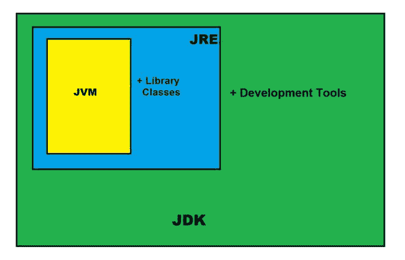
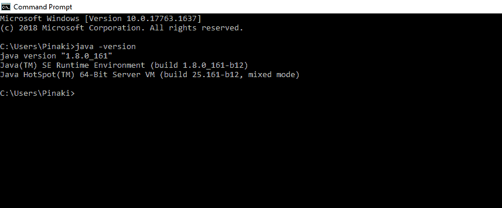

# 爪哇的 JDK

> 原文:[https://www.geeksforgeeks.org/jdk-in-java/](https://www.geeksforgeeks.org/jdk-in-java/)

Java 开发工具包(JDK)是一个跨平台的软件开发环境，它提供了开发基于 Java 的软件应用程序和小程序所必需的工具和库的集合。它是一个用在 Java 中的核心包，还有 [**JVM (Java 虚拟机)**](https://www.geeksforgeeks.org/jvm-works-jvm-architecture/) 和 JRE (Java 运行时环境)。

初学者经常会对 JRE 和 JDK 感到困惑，如果你只对在你的机器上运行 Java 程序感兴趣，那么你可以使用 Java 运行时环境轻松地做到这一点。但是，如果您想开发一个基于 Java 的软件应用程序，那么除了 JRE 之外，您可能还需要一些额外的必要工具，这就是所谓的 JDK。

**JDK = JRE+开发工具**



JAVA 开发工具包(JDK)

#### Java 开发工具包是一个 Java 平台的实现:

*   [标准版](https://en.wikipedia.org/wiki/Java_Platform,_Standard_Edition) (Java SE)，
*   [Java 企业版(Java EE)](https://en.wikipedia.org/wiki/Jakarta_EE) ，
*   [微版(Java ME)](https://en.wikipedia.org/wiki/Java_Platform,_Micro_Edition)

### JDK 的内容

JDK 有一个私有的 Java 虚拟机(JVM)和一些开发 Java 应用程序所必需的其他资源。

**JDK 包含:**

*   Java 运行时环境，
*   解释器/加载器(Java)，
*   一个编译器(javac)，
*   一个归档器(jar)和更多。

JDK 的 Java 运行时环境通常被称为私有运行时，因为它与常规的 JRE 分离，并且有额外的内容。JDK 的私有运行时包含一个 JVM 和生产环境中的所有类库，以及对开发人员有用的其他库，例如国际化库和 IDL 库。

### **最受欢迎的 JDK:**

*   **甲骨文 JDK:** 最受欢迎的 JDK 和 Java11 的主要经销商，
*   **OpenJDK:** 准备使用:JDK 15，JDK 14，JMC，
*   **Azul Systems Zing:** 高效低延迟的 Linux 操作系统 JDK，
*   **Azul Systems:** 基于祖鲁品牌的 Linux、Windows、Mac OS X、
*   **IBM J9 JDK:** 针对 AIX、Linux、Windows 等众多 OS，
*   **亚马逊 Corretto:** 最新选项，免费构建 OpenJDK，长期支持。

### 设置:

在您的开发环境中设置 JDK 非常容易，只需遵循以下简单步骤。

**安装 JDK**

*   通过[链接](https://www.oracle.com/in/java/technologies/)进入甲骨文官方下载页面
*   选择最新的 JDK 版本，然后单击下载并将其添加到您的类路径中。
*   只需检查 JDK 软件是否安装在计算机的正确位置，例如 C:\Program Files\Java\jdk11.0.9

**为 Windows 设置 JAVA _ HOME:**

*   右键单击我的电脑并选择属性。
*   转到“高级”选项卡，选择“环境变量”，然后编辑 JAVA_HOME 以指向存储 JDK 软件的确切位置，例如，C:\Program Files\Java\jdk11.0.9 是窗口中的默认位置。

Java 保持向后兼容性，所以不用担心，只要下载最新版本，你就会得到所有的旧特性和许多新特性。安装 JDK 和 JRE 后，将 java 命令添加到命令行中。您可以通过 **java -version** 命令的命令提示符来验证这一点。在某些情况下，您需要在安装 JDK 后重新启动系统。



JDK 版本

### 使用 JDK 编译和运行 Java 代码:

您可以使用 JDK 编译器将您的 Java 文本文件转换为可执行程序。您的 Java 文本段在编译后转换为**字节码**，其中携带**。类**扩展。

首先，创建一个 Java 文本文件，并使用名称保存它。这里我们将文件保存为 Hello.java。

## Java 语言(一种计算机语言，尤用于创建网站)

```java
class Hello{
    public static void main (String[] args) {
        System.out.println("Hello Geek!");
    }
}
```

之后只需使用 **javac** 命令即可，该命令在 Java 中用于编译目的。请不要忘记提供您的 java 文本文件到命令行的完整路径，否则您将得到一个错误，如“系统找不到指定的路径”，

您的命令应该类似于下面给出的示例，其中 Hello 是文件名，文件的完整路径在文件名之前指定。路径和 javac.exe 应该在引号内。

> Hello.java

您现在可以注意到 *Hello.class* 文件正在与 Hello.class 相同的目录下创建。现在，您可以简单地使用 **java Hello** 命令来运行您的代码，该命令将根据您的代码给出所需的结果。请记住，您不必包括。类来运行代码。

> c:\ user \ Pinaki \ Documents > Java hello _ world
> 
> (输出:)你好极客！

### Jar 组件:

JDK 包含许多有用的工具，其中，继 javac 之后最受欢迎的是 jar 工具。jar 文件只不过是一个完整的 Java 类包。创建。类文件，您可以将它们放在一个. jar 文件中，该文件以可预测的方式压缩和构造它们。现在，让我们把 Hello.class 转换成一个 jar 文件。

在继续之前，请注意您应该在保存 Hello.java 文件的同一目录中。现在在命令行中键入下面给出的命令。

**创建. jar 文件**

> c:\ Users \ Pinaki \ Documents >”c:\ Program Files \ Java \ JDK-11 . 0 . 9 \ bin \ jar . exe”–create–file hello . jar hello . class

现在，您可以注意到 Hello.jar 文件是使用 Hello.class 文件和 jar.exe 在同一个目录中创建的。您可以通过将 jar 文件添加到类路径中并在其中执行程序来使用它。这里-cp 代表类路径，有助于将 jar 添加到相同的类路径中。

**执行。jar 文件**

> Java-CP hello _ world . jar hello _ world

### JDK 的重要组成部分

下面是 Jdk 中最常用的组件的完整列表，这些组件在 java 应用程序的开发过程中非常有用。

<figure class="table">

| 成分 | 

使用

 |
| --- | --- |
| javac | Java 编译器将源代码转换成 Java 字节码 |
| Java 语言（一种计算机语言，尤用于创建网站） | java 应用程序的加载器。 |
| javap！javap | 类文件反汇编器， |
| javadoc | 文档生成器， |
| 冲突

 | Java Archiver 帮助管理 JAR 文件。 |
| appletviewer | 在没有网络浏览器的情况下调试 Java 小程序， |
| xjc | 接受一个 XML 模式并生成 Java 类， |
| 恰当的 | 注释处理工具， |
| jdb | 调试器， |
| jmc | Java 任务控制， |
| javap！javap | 类文件反汇编器， |
| jconsole . jconsole | 监控和管理控制台， |
| pack200 | JAR 压缩工具， |
| extcheck | 检测 JAR 文件冲突的实用工具， |
| idlj | IDL 到 Java 编译器， |
| keytool(键工具) | 密钥库操作工具， |
| jstatd | jstat 守护程序(实验性) |
| jstat(联合数据组) | JVM 统计监控工具 |
| jsel | java 9 中引入了 jshell。 |
| jstack(jstack) | 打印 Java 堆栈跟踪(实验性) |
| 副本 | Java 命令行脚本外壳。 |
| 姬塔 | Java 堆分析工具(实验性) |
| 包包包包包包包包包包包包包包包包包包包包包包包包包包包包包 | 生成独立的应用程序包。 |
| javaws | JNLP 应用程序的网络启动启动器， |
| 爪哇岛 | 集管和短截线发生器， |
| 罐装机 | jar 签名和验证工具 |
| 金佛 | 配置信息(实验) |
| javafxpackager | 打包并签署 JavaFX 应用程序 |

</figure>