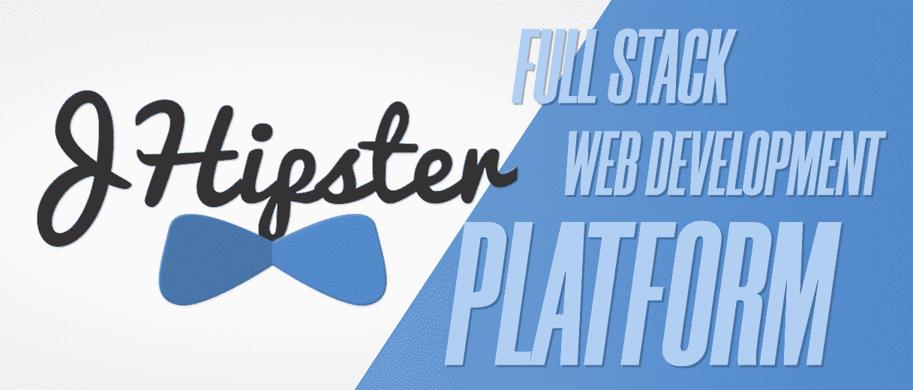

# JHipster (Java 潮人)——面向现代开发者的全栈网络开发平台

> 原文:[https://www . geesforgeks . org/JH ipster-Java-hipster-a-full-stack-web-development-platform-for-modern-developer/](https://www.geeksforgeeks.org/jhipster-java-hipster-a-full-stack-web-development-platform-for-the-modern-developer/)

根据[栈溢出开发者调查 2019](https://insights.stackoverflow.com/survey/2019) ，约 51%的开发者是[全栈开发者](https://www.geeksforgeeks.org/what-is-full-stack-development/)。那么，是什么让开发人员成为全栈开发人员呢？全栈开发人员负责开发过程的所有方面，从前端到后端，到数据库，以及测试和调试。这里，stack 指的是有助于应用程序开发的各种组件和工具。

在这个特性中，我们将讨论 **JHipster** ，一个全栈开发平台，它可以消除您在编写样板代码和建立库时 70%的工作量。JHipster 帮助您**专注于业务逻辑，而不是花时间集成技术**。它支持多种现代网络应用技术。让我们看看 JHipster 中支持的不同技术。

*   客户端技术
*   服务器端技术
*   其他支持工具
*   部署选项

## 客户端技术

近年来，客户端技术从单页应用程序快速发展到 MVVM(模型-视图-视图模型)框架。这种技术进步对开发者来说变得势不可挡。好消息是 JHipster 支持多种客户端技术。在这里，我们将讨论 JHipster 中支持的重要客户端技术。

*   用户界面技术
*   MVVM 框架
*   测试框架
*   其他工具

### 1.用户界面技术

JHipster 支持各种 UI 技术。让我们来看看一些 UI 技术。

*   [**HTML5**](https://www.geeksforgeeks.org/html5-introduction/) **和**[**CSS3**](https://www.geeksforgeeks.org/css-tutorials/)**:**HTML 5 是 HTML 的最新版本，具有新的元素、属性和行为。该版本提供了对连接性(网络套接字和网络 RTC)、离线存储、设备访问、2D/3D 图形(画布、网络图形语言和支持向量机)等功能的支持。而 CSS3 是 CSS 的最新版本。它提供了许多功能，如媒体查询，flexbox，动画等。

*   [**Bootstrap**](https://www.geeksforgeeks.org/bootstrap-tutorials/)**:**Bootstrap 是全球最流行的 UI 框架。它具有 SaaS 变量和混合，还支持强大的 JavaScript 插件。

### 2.MVVM 框架

模型-视图-视图-模型(MVVM)是一种将用户界面和服务器端分开的架构模式。JHipster 支持 Angular 和 React 框架。

**a .**T2**棱角分明**T5】

Angular 是一个基于类型脚本的 MVVM 框架，用于构建移动和桌面 web 应用程序。Angular 的一些特性如下:

*   Angular 确保高性能、离线和零步安装。
*   通过新的组件路由器，它提供了自动代码拆分和更快的应用加载。
*   它为用户界面视图提供了简单而强大的模板语法。
*   它使用科尔多瓦、爱奥尼亚或 NativeScript 的策略开发移动应用程序。
*   它提供了一个强大的命令行工具，称为 Angular CLI，用于开发和维护 Angular 应用程序。
*   它还引入了诸如提前编译(AOT)、延迟加载、反应式编程等概念。

**b .**T2**反应过来**T5】

React 是一个用于开发用户界面的 JavaScript 库，它使用类似于 XML 的语法 JSX 来编写 React 组件。它不是一个完全建立的 MVVM 框架——它只处理用户界面的渲染。但是，React 允许与其他库接口，以提供类似于 Angular 的功能。这些库包括 React Router、Redux、MobX 等。通常，JHipster 使用 TypeScript 来编写代码 React。但是也可以使用 JavaScript 进行编码。

### 3.测试框架

由于客户端框架的显著增长，也出现了对客户端测试框架的需求。JHipster 支持用于单元测试和端到端测试的各种客户端测试框架。它们如下:

*   **Jasmine:** 是一个 JavaScript 代码的测试框架；Jasmine 是一个行为驱动的单元测试框架，并且有读者友好的语法。
*   **摩卡:**摩卡是一个针对 JavaScript 代码的功能打包测试框架。它提供了许多功能，例如全局变量泄漏检测、简单异步支持、测试覆盖报告、节点本地 es 模块支持、节点调试器支持等等。
*   **金特:**金特是一个强大易用的 JavaScript 测试框架。它只需要对基于浏览器的项目进行最低限度的配置设置，对 Node.js 项目进行零配置设置。这个框架提供了在任何地方运行测试的灵活性，并且具有用于定制断言的灵活 API。
*   **量角器:**是为 Angular 和 Angular JS 应用开发的端到端测试框架。量角器是建立在网络驱动之上的，它提供了用户与应用程序的简单交互。此外，它可以在完成未完成的任务后自动执行下一个任务。

### 4.其他工具

JHipster 支持的一些其他工具包括:

*   **Webpack:** 它是一个捆绑器，有灵活的插件来捆绑你的脚本、图像、风格等。
*   **BrowserSync:** 是一款省时的浏览器同步测试工具。BrowserSync 包含许多功能，如文件更改时自动重新加载、同步用户界面交互等。通过与 Webpack/Gulljs 集成，您可以体验到高效的开发设置。
*   **Karma:** Karma 是一个执行 JavaScript 测试代码的测试运行程序。它通过创建一个 web 服务器提供了一个高效的测试环境，在这里它消除了设置大量配置的需要。它支持茉莉、摩卡等测试框架。

## 服务器端技术

随着服务器端技术的发展，开发人员能够使用各种工具和技术提供丰富的功能。让我们来看看 JHipster 支持的重要技术。

*   应用框架
*   安全
*   测试工具
*   构建工具
*   数据库选项

### 1.应用框架

随着 Spring 框架的兴起，对 JavaEE 的需求显著减少。另外，Hibernate 是另一个需要考虑的核心概念。让我们在下面讨论它们。

*   **Spring Framework:**[Spring](https://www.geeksforgeeks.org/introduction-to-spring-framework/)是最受欢迎的 Java web 应用程序框架，它让 Java 变得现代化、高效、被动和云就绪。Spring 使用控制反转(IoC)的原理，提供依赖注入和应用上下文。Spring 的一个突出特点是它以一种持久的方式结合了 IoC、面向方面编程(AOP)和技术抽象。Spring 框架中的一些模块有 [Spring Boot](https://www.geeksforgeeks.org/introduction-to-spring-boot/) 、Spring Security、Spring MVC、Spring data 等等。

*   **Hibernate:**[Hibernate](https://www.geeksforgeeks.org/introduction-to-hibernate-framework/)是 Java 最著名的对象关系映射(ORM)工具，它将面向对象的域模型映射到关系数据库方案。它使用 Java 注释进行映射，还实现了基于 Java 持久性应用编程接口(JPA)的数据访问层。Hibernate 提供的其他一些功能包括:
    *   对您的领域模型进行全文搜索。
    *   基于注释的约束。
    *   NoSQL 数据存储区的域模型持久性。
    *   命令行工具和集成开发环境插件。

### 2.安全

JHipster 支持多种安全机制。它们如下:

*   **JWT:**JSON Web token 是一种开放的、符合行业标准的 RFC 7519 方法，可在双方之间提供安全性。这里，服务器在成功验证客户端凭证后向客户端提供 JWT 令牌。
*   **会话:**是一种传统的认证机制，服务器为成功登录的客户端创建并维护一个会话。JHipster 在这个传统机制的基础上提供了更多的插件。
*   **OAuth2:** 它为应用提供了特定的授权和认证流程。与其他身份验证机制相比，OAuth2 更加复杂。这里，它使用范围机制，其中用户访问可以被限制到应用程序的某些服务。JHipster 使用 OpenID 连接来支持 OAuth2 机制。

### 3.测试工具

JHipster 支持的测试工具如下。

*   **JUnit:** JUnit 是一个 Java 测试框架，主要用于单元测试。但是当与 Spring Test 框架结合时，它也可以用于集成测试。
*   **加特林:**它是一个为你的 web 应用执行负载测试的工具。加特林使用 Scala DSL 来编写测试规范，它是测试关键应用程序性能的重要工具。
*   **黄瓜:**它是一个行为驱动开发(BDD)测试框架。黄瓜主要用于验收测试。

### 4.构建工具

Maven 和 Gradle 是 JHipster 中支持的两个服务器端构建工具。

*   **Maven:** 它是一个管理项目的构建、报告和文档的软件项目管理工具。Maven 使用项目对象模型(POM)的概念来陈述构建过程。它有一套丰富的插件。
*   **Gradle:** 它是一个加速开发人员生产力的构建工具。Gradle 有助于快速构建、自动化和交付项目。它使用 Groovy DSL 来设置构建计划和依赖关系。

### 5.数据库选项

JHipster 为大量数据库提供支持，包括 SQL 和 NoSQL 数据库。

#### A.SQL 数据库

JHipster 支持的 SQL 数据库有 H2、MySQL、马里亚数据库、PostgreSQL、MS SQL 和 Oracle。下面我们将讨论其中的几个。

1.  **马里亚数据库:**它是一个开源的关系数据库，提供快速、可扩展和健壮的服务。[马里亚数据库](https://www.geeksforgeeks.org/introduction-of-mariadb/)拥有丰富的存储引擎和插件生态系统。最新版本的 MariaDB 具有地理信息系统和 JSON 功能。
2.  **PostgreSQL:**[PostgreSQL](https://www.geeksforgeeks.org/what-is-postgresql-introduction/)是另一个开源的对象关系数据库系统，提供了可靠性、健壮性和性能。它支持高级索引技术，如 GiST、GIN、覆盖索引、繁荣过滤器等。PostgreSQL 提供了高安全性选项，包括 GSSAPI、SSPI、LDAP、SCRAM-SHA-256。PostgreSQL 的另一个特性是 JSON 对象存储，这使得它可以用作混合模型。
3.  **MS SQL:** 是企业级数据库系统，需要付费许可。微软 SQL 是智能和任务关键型应用程序的热门选择。
4.  **Oracle:** 它为访问和维护数据提供了一个性能架构。Oracle 具有企业级功能，如分片、复制、高可用性等。

#### B.NoSQL 数据库

JHipster 支持的 NoSQL 数据库如下:

1.  **MongoDB:** [MongoDB](https://www.geeksforgeeks.org/mongodb-an-introduction/) 是一个基于文档的分布式数据库。它以 JSON 格式存储数据，使其更加强大和富有表现力。它支持聚合和其他功能，如基于地理的搜索、图形搜索和文本搜索。
2.  **卡珊德拉:** [卡珊德拉](https://www.geeksforgeeks.org/features-of-cassandra/)是一个受欢迎的 NoSQL 数据库，因为它的基本架构选择。其线性可扩展性和容错特性使其最适合任务关键型应用。
3.  **elastic search:**[elastic search](https://www.geeksforgeeks.org/elasticsearch-search-engine-an-introduction/)是一个 NoSQL 的数据库，但由于其索引能力和性能，它主要用作搜索引擎。

## 其他开发工具

### 1.饭桶

GIT 是一个开源的分布式版本控制系统，用于源代码管理。它具有多种功能，包括分支和合并、方便的临时区域、多个工作流等。JHipster 使用 GIT 进行应用程序升级，也用于 Node.js 和 NPM 生态系统的平稳工作。

### 2.Node.js

[Node.js](https://www.geeksforgeeks.org/introduction-to-nodejs/) 是一个 JavaScript 运行时环境，由 NPM 管理。JHipster CLI 需要 Node.js 来运行应用程序，因为它依赖于 NodeJS 应用程序。应用程序中使用的许多工具也需要 NodeJS。

### **3。码头工人**

[Docker](https://www.geeksforgeeks.org/containerization-using-docker/) 是一种开源技术，提供操作系统级别的虚拟化或容器化。它有助于创建易于构建、部署、版本化和共享的容器。它包含应用程序在主机操作系统上运行所需的依赖关系。因此，它比虚拟机轻。与虚拟机相比，Docker 允许更多的应用程序在相同的硬件上运行。

## 部署选项

### 1\. 赫洛库

Heroku 是一个部署、管理和扩展应用的云平台。它专注于应用程序而不是容器，并支持多种编程语言。JHipster 使用 **Heroku 子生成器**将 JHipster 应用部署和更新到 Heroku 云平台。

### 2.云铸造

Cloud Foundry 是一个多云计算平台，具有基于容器的架构。它可以运行任何编程语言开发的应用程序，并且不会中断您当前的工作流。应用程序是在 JHipster 子生成器的帮助下部署的。

### 3.亚马逊网络服务

AWS 是一个云计算平台，提供平台、软件和基础设施即服务。AWS 的弹性豆茎是一个易于使用的平台，可以部署和扩展您的应用程序。使用子生成器，JHipster 可以将应用程序部署到 AWS。

JHipster 在全栈开发人员中变得越来越受欢迎。使用 JHipster，您可以更加关注业务逻辑，并且它支持多种 web 应用程序技术。它有超过 **400 个**贡献者–**谷歌、红帽、Heroku** 都是一些官方贡献者。享受用 JHipster 编码，成为所有行业的高效杰克。