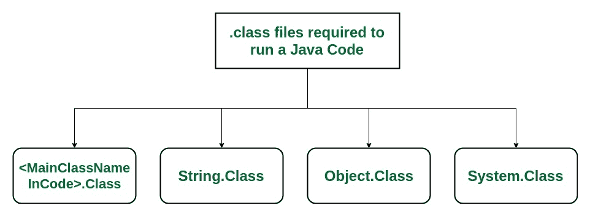
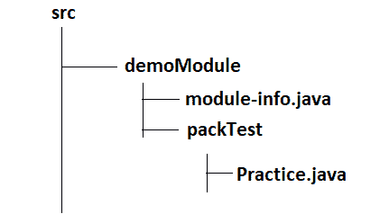

# JLink | Java 左侧

> 原文:[https://www.geeksforgeeks.org/jlink-java-linker/](https://www.geeksforgeeks.org/jlink-java-linker/)

简单来说，我们可以说 Jlink 是用来创建我们自己定制的小 JRE(Java RunTime Environment)。
JLink 是 Java 的新命令行工具(在 JDK_HOME/bin 中提供)，它允许我们链接只需要的模块(及其依赖项)的集合来创建运行时环境(我们自己的 JRE)。通常，我们使用默认的 jre 来运行由甲骨文公司提供的程序，但是如果我们想要自己的 JRE，比如极客 JRE，那么我们可以选择 JLINK。

### 现在，创建我们自己定制的 JRE 的需求是什么？

假设你写了一个两个数相加的小程序。现在这是一个非常基本的 java 程序。我们可以用默认的 JRE 运行我们的程序。

## Java 语言(一种计算机语言，尤用于创建网站)

```
public class Practice {
    public static void main(String[] args)
    {
        System.out.println(10 + 5);
    }
}
```

要运行这个程序，它将使用一个练习类文件、一个字符串类文件、一个系统类文件和一个对象类文件(因为 java 中的每个类都是对象类的子类)。所以我们需要三到四节课来运行这个程序。



我们可以用默认的 JRE 轻松运行这个程序，但是 Oracle 公司提供的 JRE 包含 4300+预定义的。类文件。当我们运行这个程序时，我们使用默认的 JRE，那么我们需要在我们的机器上维护所有 4300+类，因此内存被浪费了(JRE9 的大小是 204mb)。要运行 4kb 程序，维护一个 204mb 大小的 JRE 有什么用。因此，在客户机上浪费了大量内存。因此，定制的 JRE 最好只包含客户端机器上的这四个类。当您在程序中使用特定数量的类时，定制的 JRE 是最好的。
所以，定制化 JRE 最大的用途或者说优势，就是我们只需要使用需要的模块就可以创建一个小的 JRE。因此，Jlink 的主要目的是避免运输所有的东西，并且在内存很少的非常小的设备上运行。
JLink 还有一个插件列表，可以帮助优化我们的解决方案。
**语法:**

> **jlink[选项]–模块路径 modulepath–添加模块模块[，模块…]**

### 基于模块的应用程序的结构:



**使用基于模块的应用程序的 JLink 示例:**

module-info.java

```
 module demoModule
{
    // keeping it empty
} 
```

Practice.java

```
 package packTest public class Practice {
    public static void main(String[] args)
    {
        System.out.println("JLINK DEMO");
    }
} 
```