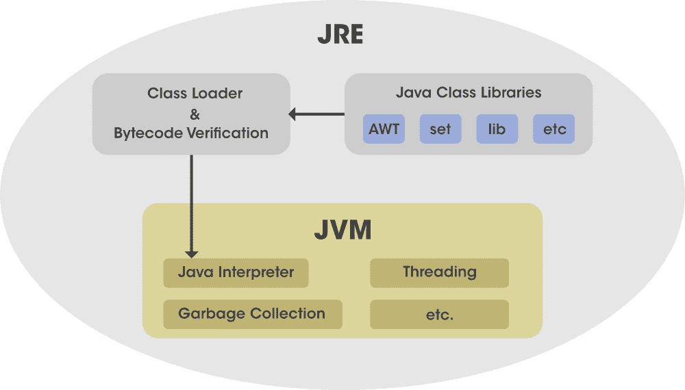

# Java 中的 JRE

> 原文:[https://www.geeksforgeeks.org/jre-in-java/](https://www.geeksforgeeks.org/jre-in-java/)

Java 运行时环境(JRE)是一个开放访问的软件发行版，它有一个 Java 类库、特定的工具和一个单独的 JVM。JRE 是 Java 开发工具包(JDK)中相互关联的组件之一。它是运行 Java 程序的设备上最常见的环境。Java 源代码被编译并转换成 Java 字节码。如果你想在任何平台上运行这个字节码，你需要 JRE。JRE 加载类检查内存访问并获取系统资源。JRE 充当操作系统之上的软件层。

### JRE 的组件

*   集成库包括 Java 数据库连接(JDBC)
*   Java 命名，接口定义语言
*   目录接口(JNDI)
*   基于互联网球间协议的远程方法调用
*   远程方法调用
*   脚本



Java 虚拟机(JVM)由 Java HotSpot 客户端和服务器虚拟机组成。

*   用户界面库包括 Swing、Java 2D、抽象窗口工具包(AWT)、可访问性、图像输入/输出、打印服务、声音、拖放(DnD)和输入法。
*   Lang 和 util 基础库，包括 lang 和 util、zip、Collections、并发实用程序、管理、Java Archive (JAR)、工具、反射、版本控制、首选项 API、引用对象、日志记录和正则表达式。
*   其他基础库，包括 Java 管理扩展(JMX)、Java 本机接口(JNI)、数学、网络、国际支持、输入/输出(I/O)、Beans、Java 覆盖机制、安全性、序列化、扩展机制以及用于 XML 处理的 Java(XML JAXP)。
*   部署技术，如 Java Web Start、部署和 Java 插件。

### **JRE**的工作

Java 开发工具包(JDK)和 Java 运行时环境(JRE)都相互作用，以创建一个可持续的运行时环境，使基于 Java 的应用程序能够在任何操作系统上无缝运行。JRE 运行时架构由下列元素组成:

1.  [类装入器](https://www.geeksforgeeks.org/classloader-in-java/)
2.  校验员字节码
3.  [翻译](https://www.geeksforgeeks.org/compiler-vs-interpreter-2/)

现在让我们简要介绍如下:

*   **类加载器** : Java 类加载器动态加载运行一个 Java 程序所需的所有类。因为类只在需要的时候加载到内存中，所以 JRE 使用的类加载器会在需要的时候自动执行这个过程。
*   **字节码校验器:**字节码校验器在将 Java 代码传递给解释器之前，会确保其格式和精度。如果代码违反系统完整性或访问权限，则该类被视为已损坏，将不会加载。
*   **解释器:**成功加载字节码后，Java 解释器创建一个 Java 虚拟机的对象，允许 Java 程序在底层机器上本机运行。

### **JRE 如何与 JVM 协同工作？**

JRE 有一个 JVM 对象、开发工具和库类。为了理解 java 运行时环境的工作原理，让我们看一个简单的 Java 程序的例子，该程序打印“GeeksForGeeks”。

**示例:**

## Java 语言(一种计算机语言，尤用于创建网站)

```java
// Java class
class GFG {

    // Main driver method 
    public static void main(String[] args) {

        // Print statement 
        System.out.println("GeeksForGeeks");
    }
}
```

**Output**

```java
GeeksForGeeks
```

一旦你编写了你的 java 程序，你必须用一个带有 ***的文件名保存它。**爪哇“*延伸。然后在你编译你的程序之后。Java 编译器的输出是字节码，这是一种独立于平台的代码。编译后，编译器生成一个**。包含字节代码的类**文件。字节码是独立于平台的，运行在所有包含 Java 运行时环境(JRE)的设备上。