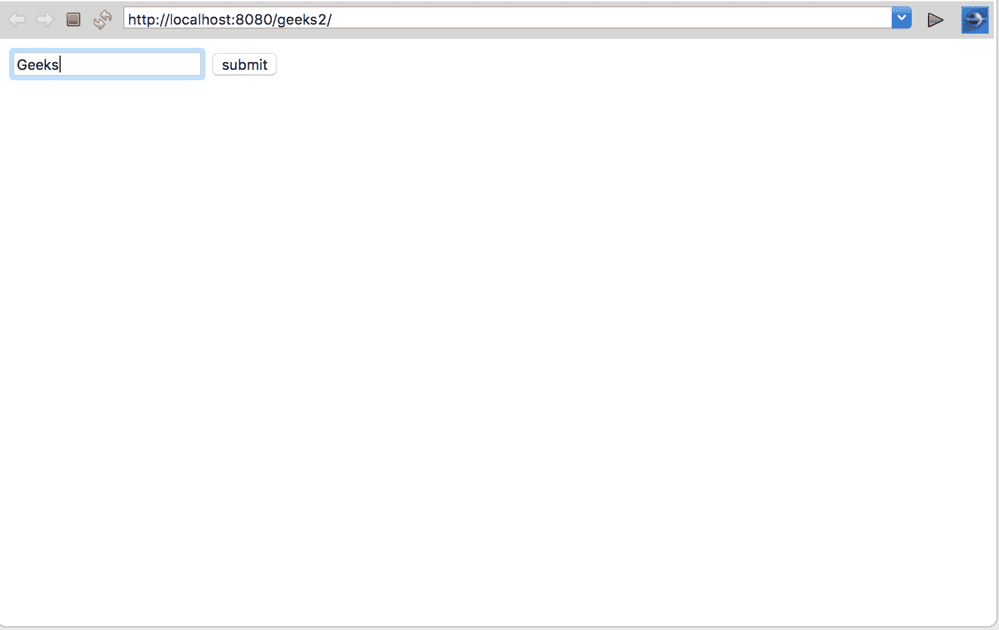
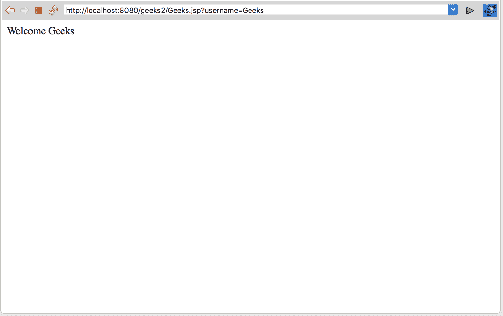

# JSP |隐式对象–请求和响应

> 原文:[https://www . geesforgeks . org/JSP-隐式-对象-请求和响应/](https://www.geeksforgeeks.org/jsp-implicit-objects-request-and-response/)

**附赠:**[JSP 简介](https://www.geeksforgeeks.org/introduction-to-jsp/)
JSP 代表 Java Server Pages，是服务器端技术。它用于创建网络应用程序和动态网络内容。JSP 的主要特性是我们可以使用 JSP 标签在 HTML 页面中插入我们的 java 代码。JSP 为您提供了独立于平台的页面。

## 超文本标记语言

```java
<%@ page language = "java" contentType = "text/html; charset = UTF-8"
    pageEncoding = "UTF-8"%>
<!DOCTYPE html PUBLIC "-//W3C//DTD HTML 4.01
Transitional//EN" "http://www.w3.org/TR/html4/loose.dtd">
<html>
<head>
<meta http-equiv = "Content-Type" content = "text/html; charset = UTF-8">
<title>Insert title here</title>
</head>
<body>

<!-- Here we are going to insert our Java code-->

<% Geeks saying hello to JSP %>
</body>
</html>
```

隐式对象是 JSP 容器在每个页面上提供给开发人员的一组 Java 对象。这些对象可以通过脚本元素作为内置变量访问，也可以通过 JavaBeans 以编程方式访问，Servlets.JSP 为您提供了总共 9 个隐式对象，如下所示

1.  *请求*:这是与请求关联的**httpersvletrequest**类的对象。
2.  *响应*:这是**httpersvletresponse**类的对象，与对客户端的响应相关联。
3.  *配置*:这是与页面关联的 **ServletConfig** 类的对象。
4.  *应用*:这是 **ServletContext** 类与应用上下文关联的对象。
5.  *会话*:这是与请求关联的 **HttpSession** 类的对象。
6.  *页面上下文*:这是**页面上下文**类的对象，封装了服务器特定特性的使用。此对象可用于查找、获取或移除属性。
7.  *页面对象*:我们使用关键字**这个**的方式对于当前对象，页面对象用来引用当前翻译的 servlet 类。
8.  *异常*:异常对象表示各个 jsp 访问的所有错误和异常。异常隐式对象的类型是 **java.lang.Throwable** 。
9.  out:这是 **PrintWriter** 对象，print 和 println 之类的方法有助于向客户端显示内容。

本文讨论了请求和响应这两个主要对象

**请求对象**
JSP 请求是一个隐式对象，由 HttpServletRequest 提供。在 servlet 中，我们必须首先导入 javax . servlet . http . HttpServletrequest，然后我们必须创建它的对象，用于从任何 HTML 表单中获取输入。
**语法:**

```java
import javax.servlet.http.HttpServletRequest;

public class LoginServlet extends HttpServlet 
{  
    protected void doPost(HttpServletRequest request, HttpServletResponse response)  
                    throws ServletException, IOException 
          { 
              HttpSession session = request.getSession()
          }
}
```

在 JSP 中，请求对象是隐式定义的，因此您不必创建对象。JSP 请求对象由 web 容器为客户端的每个请求创建。它用于获取参数值、服务器名称、服务器端口等。
在下面的例子中，我们使用一个请求对象来显示用户名。

## 超文本标记语言

```java
<!DOCTYPE html PUBLIC "-//W3C//DTD HTML 4.01 Transitional//EN"
"http://www.w3.org/TR/html4/loose.dtd">

<html>
<head>
<meta http-equiv="Content-Type" content="text/html; charset=UTF-8">
<title>Insert title here</title>
</head>
<body>
<form action = "Geeks.jsp"> 
<input type = "text" name = "username"> 
<input type = "submit" value = "submit"><br/> 
</form>
</body>
</html>
```

**输出**T2】



**响应对象**

这是与对客户端的响应相关联的 HttpServletResponse 对象。响应对象还定义了处理创建新的 HTTP 头的接口。通过这个对象，JSP 程序员可以添加新的 cookies 或日期戳、HTTP 状态代码等。

## 超文本标记语言

```java
<%@ page language="java" contentType="text/html; charset=UTF-8"
    pageEncoding="UTF-8"%>
<!DOCTYPE html PUBLIC "-//W3C//DTD HTML 4.01 Transitional//EN"
"http://www.w3.org/TR/html4/loose.dtd">
<html>
<head>
<meta http-equiv="Content-Type" content="text/html; charset=UTF-8">
<title>Insert title here</title>
</head>
<body>
<%  
String name=request.getParameter("username"); 
out.print("Welcome "+ name); 
%>   
</body>
</html>
```

**输出**T2】



在 JSP 中，响应对象是隐式定义的，因此您不必创建对象。JSP 响应对象由 web 容器为客户端的每个请求创建。它主要用于重定向到任何其他资源。
在下面的例子中，我们使用响应对象在 Geeksforgeeks 主页上发送用户。

## 超文本标记语言

```java
<!DOCTYPE html>
<html>
<head>
<meta charset="UTF-8">
<title>GeeksforGeeks</title>
</head>
<body>
<%  
//below line in JSP redirect you to geeksforgeeks page
response.sendRedirect("geeksforgeeks.org");
%>
</body>
</html>
```

**输出**T2】


**JSP 相对于 servlet 的优势:**

*   Servlets 比 JSP 更难编码。换句话说，我们可以说，JSP 是 Servlets 的替代品。
*   在 Servlets 中，静态代码和动态代码放在一起。在 JSP 中，它们是分开的。
*   PrintWriter、ServletConfig、ServletContext、HttpSession、RequestDispatcher 等的对象。由程序员在 Servlets 中创建。但是在 JSP 中，它们是内置的，被称为隐式对象。

**劣势:**

*   JSP 页面需要更多的内存来保存页面。
*   输出是 HTML 格式的，对于观众来说并不丰富。