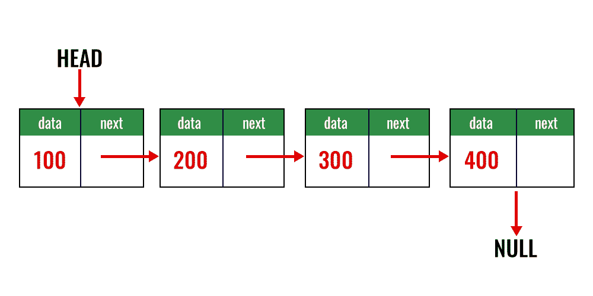

# Java 中的 LinkedList getFirst()方法

> 原文:[https://www . geesforgeks . org/linked list-get first-method-in-Java/](https://www.geeksforgeeks.org/linkedlist-getfirst-method-in-java/)

链表是 [java.util 包](https://www.geeksforgeeks.org/java-util-package-java/)中[集合框架](https://www.geeksforgeeks.org/collections-in-java-2/)的一部分。这个类是[链接列表数据结构](https://www.geeksforgeeks.org/data-structures/linked-list/)的实现，这是一个线性数据结构，其中元素不存储在连续的位置，每个元素都是一个单独的对象，有数据部分和地址部分。Java.util.LinkedList.getFirst()方法用于从链接列表中获取或检索第一个元素，或者位于列表头部的元素。



插图:

```java
Input : 4 --> 1 --> 5 --> 6 --> 1 --> 3
Output: 4
```

众所周知，getFirst()是 [LinekdList 类中已经存在的方法之一。](https://www.geeksforgeeks.org/linked-list-in-java/)它从链接列表的元素所在的对象中检索第一个元素。正如我们所知，LinkedList 是存在于 [java.util 包](https://www.geeksforgeeks.org/java-util-package-java/)中的一个类，因此，如果我们操作以下方法，语法将如下所示:

```java
import java.util.LinkedList;
LinkedList ll = new LinkedList<T>();  
ll.getFirst();
```

简单地说，如果我们想知道第一个元素，那么请执行下面列出的检查。稍后，它将作为一个示例在实现时进行说明。

**语法:**

```java
LinkedList.getFirst();
```

**返回值:**列表的第一个元素或首元素。

**示例:**

## Java 语言(一种计算机语言，尤用于创建网站)

```java
// Java Program to Illustrate getFirst() Method
// of LinkedList class

// Importing required classes
import java.io.*;
import java.util.LinkedList;

// Main class
public class GFG {

    // Main driver method
    public static void main(String args[])
    {

        // Creating an empty LinkedList by creating its
        // object Declaring object of type strings
        LinkedList<String> list = new LinkedList<String>();

        // Adding custom input elements to the List
        // Using add() method
        list.add("Geeks");
        list.add("for");
        list.add("Geeks");
        list.add("10");
        list.add("20");

        // Displaying the list(all elements inside object)
        System.out.println("LinkedList:" + list);

        // Fetching first element from the list
        // using getFirst() method
        System.out.println("The first element is: "
                           + list.getFirst());
    }
}
```

**Output:** 

```java
LinkedList:[Geeks, for, Geeks, 10, 20]
The first element is: Geeks
```