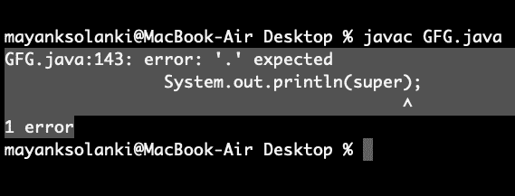

# 所有 Java 关键词列表

> 原文:[https://www.geeksforgeeks.org/list-of-all-java-keywords/](https://www.geeksforgeeks.org/list-of-all-java-keywords/)

关键字或保留字是语言中用于某些内部过程或代表某些预定义操作的字。因此，这些词不允许用作变量名或对象。如果我们这样做，我们将得到如下所示的编译时错误:

插图:

```
// Java Program to Illustrate What If We Don't
// have knowledge of Keywords(Reserve Words)

// Importing input output classes
import java.io.*;

// Main class
class GFG {

        // Main driver method
        public static void main(String[] args) {

                // Print statement
                System.out.println(super);
        }
}
```

**输出:**



Java 包含一个关键字或保留字的列表，这些关键字或保留字也可以用不同的颜色突出显示，无论是集成开发环境还是编辑器，以便区分灵活字和保留字之间的差异。下表列出了它们以及与之相关的主要操作。

<figure class="table">

| S.No | 关键字 | 使用 |
| --- | --- | --- |
| 1. | **摘要** | 指定稍后将在子类中实现类或方法 |
| 2. | **断言** | Assert 描述了放置在 java 程序中的一个谓词，以表明开发人员认为该谓词在那个地方总是正确的。 |
| 3.  | **布尔** | 只能保存真值和假值的数据类型 |
| 4. | **断开** | 一种用于中断循环的控制语句。 |
| 5. | **字节** | 一种可以保存 8 位数据值的数据类型 |
| 6. | **情况** | 在 switch 语句中用于标记文本块 |
| 7. | **抓** | 捕获 try 语句生成的异常 |
| 8. | **充电** | 可以保存无符号 16 位 Unicode 字符的数据类型 |
| 9. | **级** | 声明一个新类 |
| 10. | **继续** | 将控制发送回循环外 |
| 11. | **默认** | 在 switch 语句中指定默认代码块 |
| 12. | **做** | 开始一个边做边循环 |
| 13. | **加倍** | 一种可以保存 64 位浮点数的数据类型 |
| 14. | **否则** | 指示 if 语句中的替代分支 |
| 15. | **枚举** | Java 关键字用于声明枚举类型。枚举扩展了基类。 |
| 16. | **延伸** | 指示一个类是从另一个类或接口派生的 |
| 17. | **决赛** | 指示变量保持常数值，或者方法不会被重写 |
| 18. | **最后** | 指示将始终执行的 try-catch 结构中的代码块 |
| 19. | **浮动** | 保存 32 位浮点数的数据类型 |
| 20. | **为** | 用于启动 for 循环 |
| 21. | **如果** | 测试真/假表达式并相应地分支 |
| 22. | **执行** | 指定一个类实现一个接口 |
| 23. | **导入** | 引用其他类 |
| 24. | 实例 | 指示对象是特定类的实例还是实现接口 |
| 25. | **int** | 可以保存 32 位有符号整数的数据类型 |
| 26. | **界面** | 声明一个接口 |
| 27. | **长** | 保存 64 位整数的数据类型 |
| 28. | **原生** | 指定用本机(平台特定)代码实现方法 |
| 29. | **新增** | 创建新对象 |
| 30. | **零** | 指示引用不引用任何内容 |
| 31. | **包装** | 声明一个 Java 包 |
| 32. | **私人** | 访问说明符，指示方法或变量只能在其声明所在的类中访问 |
| 33. | **受保护** | 访问说明符，指示方法或变量只能在其声明所在的类(或声明所在类的子类或同一包中的其他类)中访问 |
| 34. | **公共** | 用于类、接口、方法和变量的访问说明符，指示一个项目在整个应用程序中是可访问的(或者定义它的类在哪里是可访问的) |
| 35. | **返回** | 将控件以及可能的返回值从被调用的方法中发送回来 |
| 36. | **短** | 可以保存 16 位整数的数据类型 |
| Thirty-seven | **静态** | 指示变量或方法是类方法(而不局限于一个特定的对象) |
| 38. | **严格 fp** | Java 关键字用于限制浮点计算的精度和舍入，以确保可移植性。 |
| 39. | **超级** | 引用类的基类(用于方法或类构造函数) |
| 40. | **开关** | 基于测试值执行代码的语句 |
| 41. | **同步** | 多线程代码中指定的关键部分或方法 |
| 42. | **这个** | 引用方法或构造函数中的当前对象 |
| 43. | **投** | 创建异常 |
| 44. | **投掷** | 指示方法可能引发哪些异常 |
| 45. | **瞬态** | 指定变量不是对象持久状态的一部分 |
| 46. | **试试** | 启动将测试异常的代码块 |
| 47. | **作废** | 指定方法没有返回值 |
| 48. | **挥发性** | 这表明变量可能异步改变 |
| 49. | **而** | 开始一段时间的循环 |

</figure>

> **注:**
> 
> *   关键字 **const** 和 **goto** 是保留的，即使它们当前没有被使用。
> 
> <figure class="table">
> 
> | **常量** | 保留供将来使用 |
> | **转到** | 保留供将来使用 |
> 
> </figure>
> 
> *   **true，false** 和 **null** 看起来像关键词，但实际上它们是**文字**。然而，它们仍然不能在程序中用作标识符。