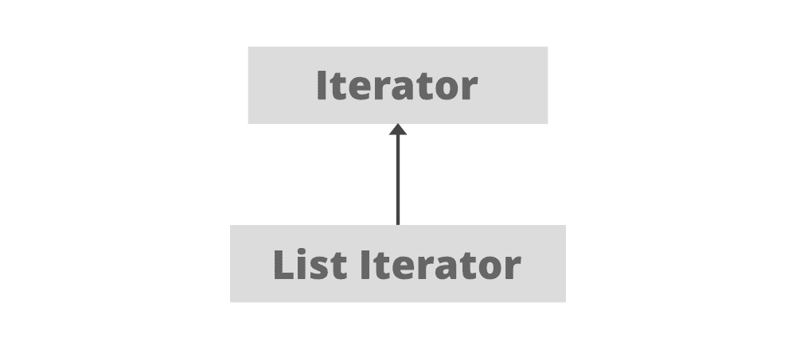
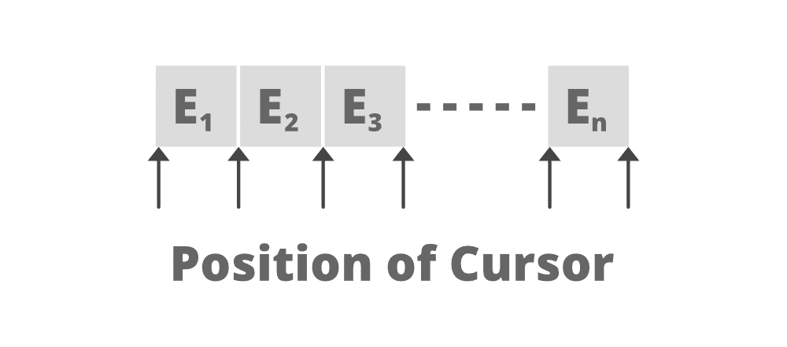

# Java 中的列表迭代器

> 原文:[https://www.geeksforgeeks.org/listiterator-in-java/](https://www.geeksforgeeks.org/listiterator-in-java/)

**ListIterator** 是四个 java 游标之一。它是一个 java 迭代器，用于遍历所有类型的列表，包括[数组列表](https://www.google.com/url?client=internal-element-cse&cx=009682134359037907028:tj6eafkv_be&q=https://www.geeksforgeeks.org/arraylist-in-java/&sa=U&ved=2ahUKEwio69n8qf_sAhVc6XMBHXWMCEQQFjAAegQIARAC&usg=AOvVaw0uNPLb8FKgi1eG5kZmt5Rk)、[向量](https://www.google.com/url?client=internal-element-cse&cx=009682134359037907028:tj6eafkv_be&q=https://www.geeksforgeeks.org/java-util-vector-class-java/&sa=U&ved=2ahUKEwjGmpCIqv_sAhVk4HMBHd9oDrAQFjAAegQIBhAB&usg=AOvVaw1o1za4FVvi46n-HuTu8hEU)、[链表](https://www.google.com/url?client=internal-element-cse&cx=009682134359037907028:tj6eafkv_be&q=https://www.geeksforgeeks.org/linked-list-in-java/&sa=U&ved=2ahUKEwj1y8WPqv_sAhV97HMBHc8kATIQFjAAegQIAxAC&usg=AOvVaw1VPmoI-OkQ09bKgvwmtIM_)、[堆栈](https://www.google.com/url?client=internal-element-cse&cx=009682134359037907028:tj6eafkv_be&q=https://www.geeksforgeeks.org/stack-class-in-java/&sa=U&ved=2ahUKEwj-87iXqv_sAhVr8XMBHQE6Bo0QFjACegQIBxAC&usg=AOvVaw0D-K9c0-1Dq9TGmdv5QkDf)等。从 **Java 1.2** 开始提供。它扩展了[迭代器](https://www.geeksforgeeks.org/iterator-interface-in-java/)界面。

**列表迭代器的层次结构**



**列表迭代器的几个要点**

*   它对于列表实现的类很有用。
*   从 java 1.2 开始提供。
*   它支持双向遍历。即向前和向后两个方向。
*   它支持所有四个 CRUD 操作(创建、读取、更新、删除)。

**列表迭代器的有趣事实**

列表迭代器中没有**当前元素**。它的光标总是位于上一个和下一个元素之间。**上一个()**将返回到上一个元素，**下一个()**将返回到下一个元素。因此，对于 n 长度的列表，有 n+1 个可能的游标。



**申报:**

```java
public interface ListIterator<E> extends Iterator<E>
```

其中 **E** 代表通用类型，即任何类型/用户定义对象的任何参数。

**获取列表迭代器的语法:**

```java
ListIterator<E> listIterator()  
```

这将返回列表中所有元素的列表迭代器。

**示例:**

## Java 语言(一种计算机语言，尤用于创建网站)

```java
// java program to show the usage of listIterator

import java.util.*;

public class ListIteratorDemo {
    public static void main(String[] args)
    {
          // create a list of names
        List<String> names = new LinkedList<>();
        names.add("Welcome");
        names.add("To");
        names.add("Gfg");

        // Getting ListIterator
        ListIterator<String> namesIterator
            = names.listIterator();

        // Traversing elements
        while (namesIterator.hasNext()) {
            System.out.println(namesIterator.next());
        }

        // for-each loop creates Internal Iterator here.
        for (String s : names) {
            System.out.println(s);
        }
    }
}
```

**Output**

```java
Welcome
To
Gfg
Welcome
To
Gfg

```

### 列表迭代器是一个双向迭代器。对于这个功能，它有两种方法:

**1。正向迭代**

*   **hasNext():** 当列表向前遍历时有更多元素要遍历时，此方法返回 true
*   **next():** 这个方法返回列表的下一个元素，并推进光标的位置。
*   **nextIndex():** 此方法返回调用 next()函数时将返回的元素的索引。

**2。反向迭代**

*   **hasPrevious():** 当列表在反向遍历时有更多元素要遍历时，此方法返回 true
*   **previous():** 该方法返回列表的前一个元素，并将光标向后移动一个位置。
*   **previousIndex():** 此方法返回调用 previous()函数时将返回的元素的索引。

**使用列表迭代器显示向前和向后方向迭代的示例代码:**

## Java 语言(一种计算机语言，尤用于创建网站)

```java
// java program to traverse the list both in forward and
// backward direction using listIterator
import java.util.*;

public class GFG {
    public static void main(String[] args)
    {
          // list of names
        List<String> names = new LinkedList<>();
        names.add("learn");
        names.add("from");
        names.add("Geeksforgeeks");

        // Getting ListIterator
        ListIterator<String> listIterator
            = names.listIterator();

        // Traversing elements
        System.out.println("Forward Direction Iteration:");
        while (listIterator.hasNext()) {
            System.out.println(listIterator.next());
        }

        // Traversing elements, the iterator is at the end
        // at this point
        System.out.println("Backward Direction Iteration:");
        while (listIterator.hasPrevious()) {
            System.out.println(listIterator.previous());
        }
    }
}
```

**Output**

```java
Forward Direction Iteration:
learn
from
Geeksforgeeks
Backward Direction Iteration:
Geeksforgeeks
from
learn

```

### 数组列表迭代器方法

**A .列表迭代器()**

[**Java . util . ArrayList**](https://www.geeksforgeeks.org/arraylist-in-java/)类的[列表迭代器()](https://www.google.com/url?client=internal-element-cse&cx=009682134359037907028:tj6eafkv_be&q=https://www.geeksforgeeks.org/arraylist-listiterator-method-in-java-with-examples/&sa=U&ved=2ahUKEwilqYDVqv_sAhXt7HMBHWodBmYQFjAAegQIBhAC&usg=AOvVaw3Gf4Hwd4De5hdimi9q22Nn)方法用于返回列表中元素的列表迭代器(按适当的顺序)。返回的列表迭代器是快速失败的。

**语法:**

```java
public ListIterator listIterator()

```

**返回值:**这个方法在这个列表的元素上返回一个**列表迭代器**(按照正确的顺序)。

**B .)列表迭代器(int index)**

这个[列表迭代器(int index)](https://www.google.com/url?client=internal-element-cse&cx=009682134359037907028:tj6eafkv_be&q=https://www.geeksforgeeks.org/arraylist-listiterator-method-in-java-with-examples/&sa=U&ved=2ahUKEwilqYDVqv_sAhXt7HMBHWodBmYQFjAAegQIBhAC&usg=AOvVaw3Gf4Hwd4De5hdimi9q22Nn) 方法用于从列表中的指定位置开始，返回列表迭代器，遍历这个列表中的元素(按照正确的顺序)。指定的索引指示对 next 的初始调用将返回的第一个元素。对 previous 的初始调用将返回具有指定索引减 1 的元素。返回的列表迭代器是快速失败的。

**语法:**

```java
public ListIterator listIterator(int index)

```

**参数:**该方法将第一个元素的**索引作为从列表迭代器返回的参数(通过调用 next)**

**返回值:**这个方法从列表中的指定位置开始，在这个列表中的元素上返回一个**列表迭代器**。

**异常:**如果索引超出范围(索引大小())，该方法抛出**indexout of boundsexception**。

**优势:**

*   它支持所有四个 CRUD(创建、读取、更新、删除)操作。
*   它支持双向遍历，即正向和反向迭代。
*   易于使用的简单方法名称。

**限制:**

*   这个迭代器只用于列表实现类。
*   不是通用光标。
*   它并不适用于所有集合 API。
*   列表迭代器不支持元素的并行迭代。
*   listiterator 不支持大量元素迭代的良好性能。

### 迭代器 v/s 列表迭代器

**相似之处:**

*   它们都是在 java 1.2 中引入的。
*   它们都用于迭代列表。
*   它们都支持正向遍历。
*   它们都支持读取和删除操作。

**差异:**

<figure class="table">

| 

迭代程序

 | 

**列表迭代器**

 |
| --- | --- |
| 它可以遍历任何类型的集合。 | 它只遍历列表集合实现的类，如[链接列表](https://www.geeksforgeeks.org/linked-list-in-java/)、[数组列表](https://www.geeksforgeeks.org/arraylist-in-java/)等。 |
| 遍历只能向前进行。 | 元素的遍历可以向前和向后进行。 |
| 迭代器对象可以通过调用集合类的迭代器()方法来创建。 | ListIterator 对象可以通过调用集合类的 directions listIterator()方法来创建。 |
| 不允许删除元素。 | 允许删除元素。 |
| 做加法运算时抛出**ConcurrentModificationException**。因此，不允许添加。 | 允许添加元素。 |
| 在迭代器中，我们不能访问遍历元素的索引。 | 在 listIterator 中，我们有 nextIndex()和 nextPrevious()方法来访问被遍历或下一个遍历元素的索引。 |
| 不允许修改任何元素。 | 允许修改。 |

</figure>

### 列表迭代器的方法

<figure class="table">

| 

方法

 | 

描述

 |
| --- | --- |
| 无效添加 | 此方法在列表中插入指定的元素。 |
| boolean hasNext()， | 如果列表有更多元素要遍历，则返回 true。 |
| 布尔 hasPrevious() | 如果列表迭代器在向后遍历列表时有更多的元素，则返回 true。 |
| e 下一个() | 此方法返回下一个元素，并将光标增加一个位置。 |
| int nextIndex（） | 此方法返回元素的索引，该索引将在调用 next()方法时返回。 |
| e 上一次() | 此方法返回列表的前一个元素，并将光标向后移动一个位置。 |
| int previousIndex() | 此方法返回调用上一个()方法时将返回的元素的索引。 |
| 空隙去除() | 此方法从调用 next()或 previous()方法元素时返回的列表中移除最后一个元素。 |
| 无效集(E e) | 此方法用指定的元素替换调用 next()或 previous()方法时返回的最后一个元素。 |

</figure>

### 在接口 java 中声明的方法。乌提尔。迭代程序

<figure class="table">

| 

方法

 | 

描述

 |
| --- | --- |
| 默认无效剩余时间(消费者 super E>行动) | 对剩余的每个元素执行给定的操作，直到所有元素都被处理完或者该操作引发异常。 |

</figure>

**参考:**[https://docs . Oracle . com/en/Java/javase/11/docs/API/Java . base/Java/util/listiterator . html](https://docs.oracle.com/en/java/javase/11/docs/api/java.base/java/util/ListIterator.html)