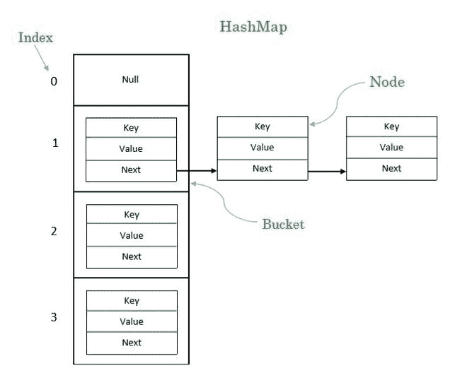

# Java 中 HashMap 的加载因子，示例

> 原文:[https://www . geesforgeks . org/load-factor-in-hashmap-in-Java-with-examples/](https://www.geeksforgeeks.org/load-factor-in-hashmap-in-java-with-examples/)

[HashMap](https://www.geeksforgeeks.org/java-util-hashmap-in-java/) 是实现 [Java Collections](https://www.geeksforgeeks.org/collections-in-java-2/) 框架的[地图](https://www.geeksforgeeks.org/map-interface-java-examples/)接口的类。HashMap 最重要的特性是它对于**检索**和**插入**具有恒定的时间性能。决定哈希映射性能的两个因素是:

*   初始容量
*   负载系数

在我们解释什么是 HashMap 的负载因子之前，理解它的结构是很重要的。

哈希表的节点包含键值对，就像映射中的节点一样。HashMap 有包含节点的桶，一个桶可以包含多个节点。哈希表的基本结构如下:

哈希表结构示意图

**索引**:是对键的哈希值和数组大小减一进行按位 AND 运算后得到的整数值。

> index = hashcode(key)&(ArraySize–1)

其中 hashcode 是一个预定义的函数，返回键散列的整数值，ArraySize 是 HashMap 中的桶数。

**桶**:是节点的链表结构。

**节点**:是 HashMap 的基本单位。它包含键值对和到下一个节点的链接。

声明 HashMap 对象的语法如下:

> HashMap objectName =新 HashMap(int initialCapacity，float loadFactor)

### 初始容量

初始容量本质上是哈希表中的桶数，默认情况下为 *2 4 = 16* 。一个好的 HashMap 算法会将相等数量的元素分配给所有的桶。

假设我们有 16 个元素，那么每个桶将有一个节点，任何元素的搜索将通过一次查找来实现。如果我们有 32 个元素，那么每个桶将有 2 个节点，对任何元素的搜索将通过 2 次查找来实现。类似地，如果我们有 64 个元素，那么每个桶将有 4 个节点，对任何元素的搜索将通过 4 次查找来实现，以此类推。

正如您可以观察到的，当元素的数量使查找增量的数量增加一倍时，这有利于性能。

但是当元素的数量达到一个很高的值，比如 10，000，在这种情况下，我们将需要 625 次查找，会发生什么呢？同样，如果元素的数量是 10，00，000，我们将需要 62，500 次查找。如此高的查找数量会降低哈希映射的性能。这就是负载系数发挥作用的地方。

### 负载系数

负载系数是一个阈值，如果当前元素与初始容量的比率超过该阈值，则容量会增加，因此哈希映射的操作复杂性保持为 0(1)。O(1)的操作复杂性的含义是指检索和插入操作花费恒定的时间。
*HashMap 的默认负载系数是 **0.75f** 。*

#### *我们如何决定何时增加产能？*

让我们举个例子，因为默认情况下初始容量是 16，所以我们现在有 16 个桶。

> 我们插入第一个元素，当前负载系数将是 1/16 = 0.0625。支票是 0.0625 > 0.75？答案是否定的，因此我们不增加容量。
> 
> 接下来我们插入第二个元素，当前负载系数将是 2/16 = 0.125。支票是 0.125 > 0.75？答案是否定的，因此我们不增加容量。
> 
> 同样，对于第三个元素，负载系数= 3/16 = 0.1875 不大于 0.75，容量无变化。
> 
> 第 4 个元素，负载系数= 4/16 = 0.25 不大于 0.75，容量无变化。
> 
> 第 5 个元素，负载系数= 5/16 = 0.3125 不大于 0.75，容量无变化。
> 
> 第 6 个元素，负载系数= 6/16 = 0.375 不大于 0.75，容量无变化。
> 
> 第 7 个元素，负载系数= 7/16 = 0.4375 不大于 0.75，容量无变化。
> 
> 第 8 个元素，负载系数= 8/16 = 0.5 不大于 0.75，容量无变化。
> 
> 第 9 个元素，负载系数= 9/16 = 0.5625 不大于 0.75，容量无变化。
> 
> 第 10 个元素，负载系数= 10/16 = 0.625 不大于 0.75，容量无变化。
> 
> 第 11 个元素，负载系数= 11/16 = 0.6875 不大于 0.75，容量无变化。
> 
> 第 12 个元素，负载系数= 12/16 = 0.75 等于 0.75，容量仍然没有变化。
> 
> 第 13 个元素，负载系数= 13/16 = 0.8125 大于 0.75，在插入第 13 个元素时我们的容量翻倍。
> 
> 现在容量是 32。

***以类似的方式，每次插入跨越 0.75 的负载系数时，对于 get(){ retrieve }和 put(){ insert }操作的恒定时间性能，容量会加倍。**T3】*