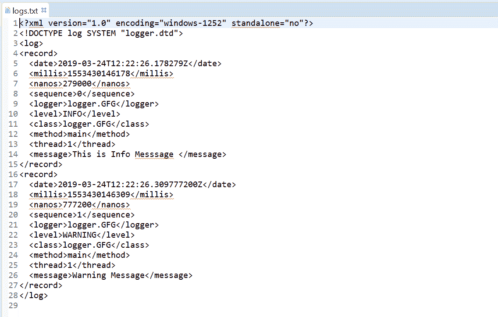

# Java 中的 Logger addHandler()方法，示例

> 原文:[https://www . geesforgeks . org/logger-addhandler-method-in-Java-with-examples/](https://www.geeksforgeeks.org/logger-addhandler-method-in-java-with-examples/)

**addHandler()** 一个**日志记录器**类的方法，用于添加一个日志处理程序来接收日志消息。处理程序是 JVM 的一个组件，负责实际记录到定义的输出编写器，如文件、控制台输出等。一个或多个处理程序可以添加到记录器中。当使用记录器记录不同类型的消息时，日志将被转发到处理程序的输出。默认情况下，记录器将其输出发送给其父记录器。所以我们可以说父记录器是子记录器的一种处理程序。
**语法:**

```
public void addHandler(Handler handler)
                throws SecurityException
```

**参数:**该方法接受一个参数**处理程序**，代表一个日志处理程序。
**返回值:**此方法不返回任何内容。
**异常:**这个方法抛出 **SecurityException** 如果存在安全管理器，这个记录器不是匿名的，调用者没有 LoggingPermission(“控件”)。
以下程序说明了 isLoggable()方法:
**程序 1:**

## Java 语言(一种计算机语言，尤用于创建网站)

```
// Java program to demonstrate
// Logger.addHandler() method

import java.util.logging.*;
import java.io.IOException;

public class GFG {

    private static Logger logger
        = Logger.getLogger(
            GFG.class.getName());

    public static void main(String args[])
        throws SecurityException, IOException
    {

        // Create a file handler object
        FileHandler handler = new FileHandler("logs.txt");

        // Add file handler as
        // handler of logs
        logger.addHandler(handler);

        // Log message
        logger.info("This is Info Message ");
        logger.log(Level.WARNING,
                   "Warning Message");
    }
}
```

**输出:**
log . txt 文件上打印的输出如下所示-



阿德玛

**节目 2:**

## Java 语言(一种计算机语言，尤用于创建网站)

```
// Java program to demonstrate
// Logger.addHandler() method

import java.util.logging.*;
import java.io.IOException;

public class GFG {

    private static Logger logger
        = Logger.getLogger(
            GFG.class.getName());

    public static void main(String args[])
        throws SecurityException, IOException
    {

        // Create a ConsoleHandler object
        ConsoleHandler handler
            = new ConsoleHandler();

        // Add console handler as
        // handler of logs
        logger.addHandler(handler);

        // Log message
        logger.info("This is Info Message ");
        logger.log(Level.WARNING, "Warning Message");
    }
}
```

控制台输出上打印的输出如下所示-


addHandler(Java . util . logging . handler)

**参考文献:**[https://docs . Oracle . com/javase/10/docs/API/Java/util/logging/logger . html # addHandler(Java . util . logging . handler)](https://docs.oracle.com/javase/10/docs/api/java/util/logging/Logger.html#addHandler(java.util.logging.Handler))