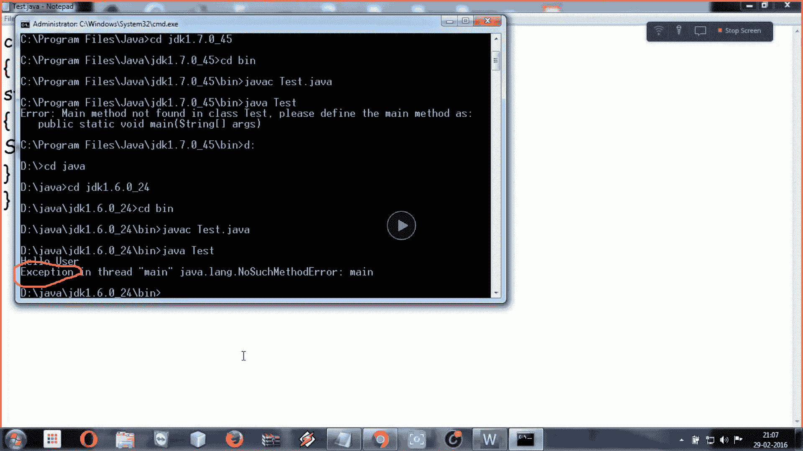
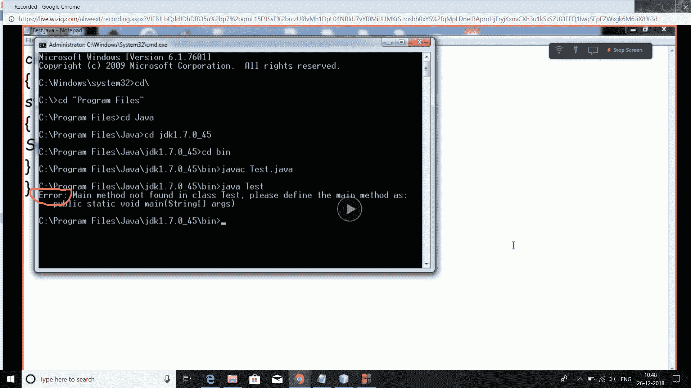

# Java 中 main 方法是强制的吗？

> 原文:[https://www.geeksforgeeks.org/main-method-compulsory-java/](https://www.geeksforgeeks.org/main-method-compulsory-java/)

这个问题的答案取决于你使用的 java 版本。在 JDK 7 之前，主方法在 java 程序中不是强制性的。

*   你可以在[静态块](https://www.geeksforgeeks.org/g-fact-79/)下写满你的代码，它就能正常运行了。
*   一旦在 main()之前加载了类，就首先执行静态块；调用方法，因此在调用 main()之前。main 通常被声明为静态方法，因此 [Java 不需要对象来调用 main 方法。](https://www.geeksforgeeks.org/jvm-create-object-main-class-class-contains-main/)
*   当您将给出 run 命令时(即在记事本中的下述程序中的 java Test)，那么编译器假定 Test 是 main()所在的类，并且由于编译器加载了 main()方法，静态块已经准备好被执行。所以在这里，它将首先运行静态块，然后它将看到没有 main()在那里。因此会给**一个“异常”**，因为异常是在执行的时候出现的。但是，如果我们不想出现异常，我们可以通过
    System.exit(0)终止程序；

但是，从 JDK7 主方法是强制性的。编译器将首先验证 main()是否存在。如果你的程序不包含 main 方法，那么你会得到一个**错误**“在类中找不到 main 方法”。它会给出一个错误(字节码验证错误，因为在它的字节码中，main 不在那里)而不是一个异常，因为程序还没有运行。

**注意:-** 但是，这两个程序都会得到编译，因为对于编译，我们不需要 main()方法。

```
// This program will successfully run
// prior to JDK 7
public class Test 
{
    // static block
    static
    {
        System.out.println("Hello User");
    }
}
```

下面是输出的截图，帮助你实际地想象同样的事情。我已经在记事本上运行了这个程序，这样你就可以理解为什么这个异常在最新版本中变成了错误。

*   **如果跑在 JDK 之前 7**

    JAVA 6 版本的输出

    T6】*   **If run on JDK 7,8 and so on…**

    JAVA 7 中的输出

    本文由**高拉夫·米格拉尼**供稿。如果你喜欢 GeeksforGeeks 并想投稿，你也可以使用[contribute.geeksforgeeks.org](http://www.contribute.geeksforgeeks.org)写一篇文章或者把你的文章邮寄到 contribute@geeksforgeeks.org。看到你的文章出现在极客博客主页上，帮助其他极客。

    如果你发现任何不正确的地方，或者你想分享更多关于上面讨论的话题的信息，请写评论。