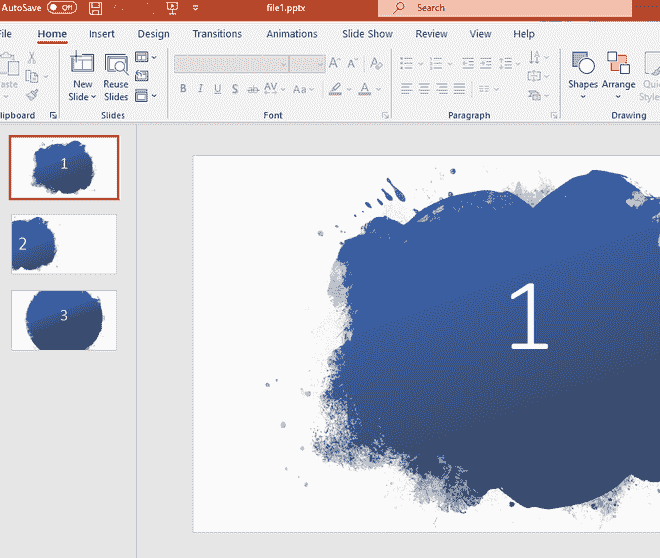
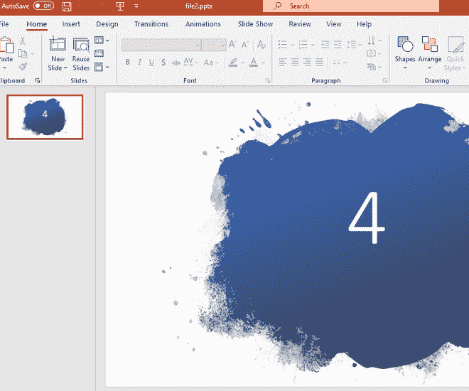
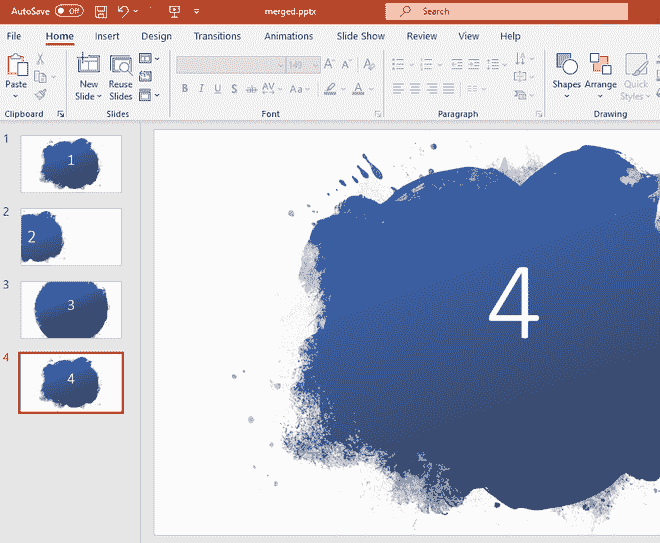

# 使用 java 合并多个 PPTs】

> 原文:[https://www . geesforgeks . org/merging-multi-ppts-using-Java/](https://www.geeksforgeeks.org/merging-multiple-ppts-using-java/)

使用 Java 合并多个 PowerPoint 演示文稿文件。要实现这一点，请使用一个名为 Apache POI 的 Java 库。Apache POI 是由 Apache 软件基金会运营的项目，之前是雅加达项目的子项目，提供纯 Java 库，用于读写 Microsoft Office 格式的文件，如 Word、PowerPoint 和 Excel。使用 [Apache](https://www.geeksforgeeks.org/apache-poi-introduction/) 指南为视窗/Linux 系统安装 Apache 兴趣点库。

**示例:**

```
Input : file1.pptx, file2.pptx
Output: merged.pptx

Input : file1.pptx file2.pptx file3.pptx
Output: merged.pptx
```

**输入文件:**



file1.pptx



file2.pptx

**输出文件:**



merged.pptx

**进场:**

1.  获取当前工作目录路径并列出所有演示文件
2.  使用 apache POI 包中的 **XMLSlideShow** 创建一个空的演示对象
3.  遍历列表中的每个演示文件，并将幻灯片追加到空的演示对象中
4.  保存新的合并演示文件

下面是上述方法的实现:

## Java 语言(一种计算机语言，尤用于创建网站)

```
// Merging Multiple PPTs using java
import java.io.FileInputStream;
import java.io.FileOutputStream;
import java.io.IOException;
import java.io.File;
import java.util.*;

// importing apache POI environment packages
import org.apache.poi.xslf.usermodel.XMLSlideShow;
import org.apache.poi.xslf.usermodel.XSLFSlide;

public class MergePPT {
    public static void main(String args[])
        throws IOException
    {

        // creating empty presentation
        XMLSlideShow ppt = new XMLSlideShow();

        String path = System.getProperty("user.dir");
        // getting path of current working directory

        File file = new File(path);
        // creating empty file using File object

        String[] fileList = file.list();
        // returns an array of all files from current
        // working directory

        ArrayList<String> presentationList
            = new ArrayList<String>();
        for (String str : fileList) {
            if (str.contains(".pptx"))
                presentationList.add(str);
        }
        // filtering all presentation file paths and
        // appending to presentationList

        if (presentationList.isEmpty() == false) {

            for (String arg : presentationList) {

                FileInputStream inputstream
                    = new FileInputStream(arg);
                // getting current presentation file path in
                // a FileInputStream
                XMLSlideShow src
                    = new XMLSlideShow(inputstream);
                // getting all the slides of the
                // presentation file in a XMLSlideShow
                // object
                for (XSLFSlide srcSlide : src.getSlides()) {

                    ppt.createSlide().importContent(
                        srcSlide);
                    // appending each presentation slide to
                    // empty presentation object ppt
                }
            }
            String mergedFile = path + "/merged.pptx";
            // creating new file path
            FileOutputStream out
                = new FileOutputStream(mergedFile);
            // creating the file object

            ppt.write(out);
            // saving the changes to the new file
            System.out.println(
                "All files merged successfully!");
            out.close();
        }
        else
            System.out.println(
                "No Presentation files found in current directory!");
    }
}
```

**输出:**


输出