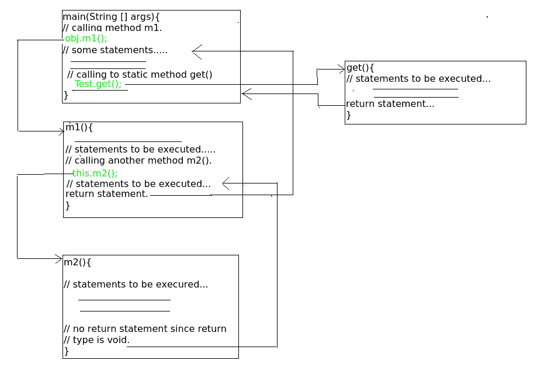

# Java 中的方法

> 原文:[https://www.geeksforgeeks.org/methods-in-java/](https://www.geeksforgeeks.org/methods-in-java/)

方法是执行特定任务并将结果返回给调用方的语句的集合。一个方法可以执行一些特定的任务而不返回任何东西。方法允许我们在不重新输入代码的情况下**重用**代码。在 Java 中，每个方法都必须是不同于 C、C++和 Python 等语言的某个类的一部分。

> **注意:**方法是省时的，帮助我们重用代码而不需要重新输入代码。

修改器分为*和*两组:

1.  [访问修饰符](https://www.geeksforgeeks.org/access-modifiers-java/)控制访问级别
2.  [非访问修饰符](https://www.geeksforgeeks.org/non-access-modifiers-in-java/) 不控制访问级别，但提供其他功能

有四种类型的 Java 访问修饰符:

1.  **私有:**私有修饰符的访问级别只在类内。不能从类外部访问它。
2.  **默认:**默认修改器的访问级别仅在包内。不能从包外部访问它。如果不指定任何访问级别，它将是默认的。
3.  **Protected:** 受保护修饰符的访问级别是通过子类在包内和包外。如果不创建子类，则不能从包外部访问它。
4.  **公共:**公共修改器的访问级别无处不在。可以从类内、类外、包内和包外访问它。

**有一些 Java 非访问修饰符:**

1.  **静态:**成员属于类，不属于该类的对象。
2.  **final:** 变量值一旦赋值就不能更改，方法不能被覆盖，类不能被继承。
3.  **抽象:**如果应用于方法–必须在子类中实现，如果应用于类–包含抽象方法
4.  **同步:**控制线程对块/方法的访问。
5.  **volatile:** 变量值总是从主内存中读取，而不是从特定线程的内存中读取。
6.  **瞬态:**序列化对象时会跳过该成员。

**方法声明**

通常，方法声明有六个组成部分:

*   **修饰符** -:定义方法的**访问类型**，即在您的应用程序中可以从哪里访问它。在 Java 中，有 4 种类型的访问说明符。
    *   public:可在应用程序的所有类中访问。
    *   受保护的:可在定义它的类及其子类中访问
    *   private:只能在定义它的类中访问。
    *   default(在不使用任何修饰符的情况下声明/定义):可在定义其类的同一个类和包中访问。
*   **返回类型**:方法返回的值的数据类型，如果不返回值则为 void。
*   **方法名**:字段名的规则也适用于方法名，只是约定有点不同。
*   **参数列表**:输入参数的逗号分隔列表被定义，前面是数据类型，在括号内。如果没有参数，则必须使用空括号()。
*   **异常列表**:方法预期可以抛出的异常，可以指定这些异常。
*   **法身**:围在牙套之间。执行预期操作所需执行的代码。


**方法签名**:由方法名称和参数列表(参数数量、参数类型和参数顺序)组成。返回类型和异常不被认为是它的一部分。

上述函数的方法签名:

```
 max(int x, int y) 
```

**如何命名一个方法？**:方法名通常是一个单词，应该是小写的**动词**或多单词，以小写的**动词**开头，后跟**形容词、名词…..**第一个单词后，每个单词的第一个字母要大写。比如 findSum、
computeMax、setX、getX

一般来说，一个方法在定义它的类中有一个唯一的名称，但是有时一个方法可能与同一个类中的其他方法名称同名，因为在 Java 中允许[方法重载。](https://www.geeksforgeeks.org/overloading-in-java/)

**方法调用**

需要调用方法才能使用其功能。调用方法时可能有三种情况:
方法返回到调用它的代码，当:

*   它完成了方法中的所有语句
*   它到达一个返回语句
*   引发异常

**例**

## Java 语言(一种计算机语言，尤用于创建网站)

```
// Java Program to Illustrate Methods

// Importing required classes
import java.io.*;

// Class 1
// Helper class
class Addition {

    // Initially taking sum as 0
    // as we have not started com[utation
    int sum = 0;

    // Method
    // To add two numbers
    public int addTwoInt(int a, int b)
    {

        // Adding two integer value
        sum = a + b;

        // Returning summation of two values
        return sum;
    }
}

// Class 2
// Helper class
class GFG {

    // Main driver method
    public static void main(String[] args)
    {

        // Creating object of class 1 inside main() method
        Addition add = new Addition();

        // Calling method of above class
        // to add two integer
        // using instance created
        int s = add.addTwoInt(1, 2);

        // Printing the sum of two numbers
        System.out.println("Sum of two integer values :"
                           + s);
    }
}
```

**Output**

```
Sum of two integer values :3

```

**例 2**

## Java 语言(一种计算机语言，尤用于创建网站)

```
// Java Program to Illustrate Method Calling
// Via Different Ways of Calling a Method

// Importing required classes
import java.io.*;

// Class 1
// Helper class
class Test {

    public static int i = 0;

    // Constructor of class
    Test()
    {

        // Counts the number of the objects of the class
        i++;
    }

    // Method 1
    // To access static members of the class and
    // and for getting total no of objects
    // of the same class created so far
    public static int get()
    {

        // statements to be executed....
        return i;
    }

    // Method 2
    // Instance method calling object directly
    // that is created inside another class 'GFG'.

    // Can also be called by object directly created in the
    // same class and from another method defined in the
    // same class and return integer value as return type is
    // int.
    public int m1()
    {

        // Display message only
        System.out.println(
            "Inside the method m1 by object of GFG class");

        // Calling m2() method within the same class.
        this.m2();

        // Statements to be executed if any
        return 1;
    }

    // Method 3
    // Returns nothing
    public void m2()
    {

        // Print statement
        System.out.println(
            "In method m2 came from method m1");
    }
}

// Class 2
// Main class
class GFG {

    // Main driver method
    public static void main(String[] args)
    {

        // Creating object of above class inside thi class
        Test obj = new Test();

        // Calling method 2 inside main() method
        int i = obj.m1();

        // Display message only
        System.out.println(
            "Control returned after method m1 :" + i);

        // Call m2() method
        // obj.m2();
        int no_of_objects = Test.get();

        // Print statement
        System.out.print(
            "No of instances created till now : ");

        System.out.println(no_of_objects);
    }
}
```

**Output**

```
Inside the method m1 by object of GFG class
In method m2 came from method m1
Control returned after method m1 :1
No of instances created till now : 1

```

上述程序的控制流程如下:



**方法调用的内存分配**

方法调用是通过堆栈实现的。每当调用一个方法时，都会在堆栈区域内创建一个堆栈框架，此后，传递给该被调用方法的参数以及该方法返回的局部变量和值都存储在该堆栈框架中，当被调用方法的执行完成时，分配的堆栈框架将被删除。有一个跟踪堆栈顶部的堆栈指针寄存器，它会进行相应的调整。

**相关文章:**

*   [Java](https://www.geeksforgeeks.org/g-fact-31-java-is-strictly-pass-by-value/) 通过值严格通过
*   [Java 中方法重载和空错误](https://www.geeksforgeeks.org/method-overloading-null-error-java/)
*   [我们可以重载或者覆盖 Java 中的静态方法吗？](https://www.geeksforgeeks.org/can-we-overload-or-override-static-methods-in-java/)
*   [Java 小测验](https://www.geeksforgeeks.org/quiz-corner-gq/)

本文由 **Nitsdheerendra** 供稿。如果你喜欢 GeeksforGeeks 并想投稿，你也可以使用[write.geeksforgeeks.org](http://www.write.geeksforgeeks.org)写一篇文章或者把你的文章邮寄到 review-team@geeksforgeeks.org。看到你的文章出现在极客博客主页上，帮助其他极客。
如果你发现任何不正确的地方，或者你想分享更多关于上面讨论的话题的信息，请写评论。