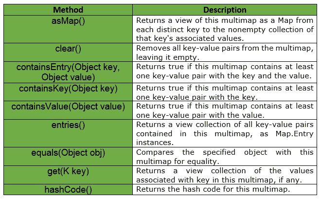
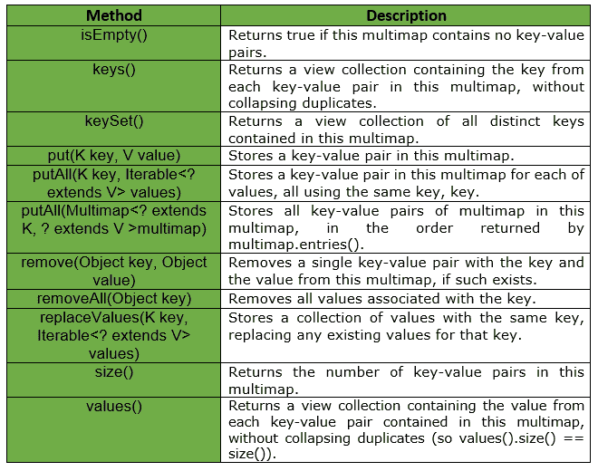
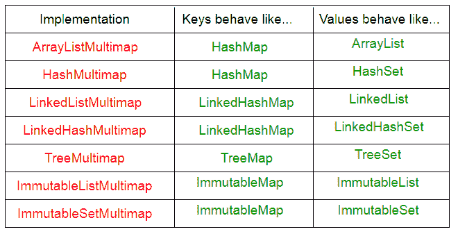

# 爪哇番石榴中的 MultiMap

> 原文:[https://www.geeksforgeeks.org/multimap-in-java-guava/](https://www.geeksforgeeks.org/multimap-in-java-guava/)

**简介:**一个 Multimap 是将按键与任意 ***多个值*** 关联的通用方式。Guava 的 Multimap 框架使得处理从键到多个值的映射变得容易。有两种方法可以从概念上考虑多映射:
**1)** 是从单个键到单个值的映射的集合。

```
a -> 1
a -> 2
a -> 4
b -> 3
c -> 5

```

**2)** 作为从唯一键到值集合的映射。

```
a -> [1, 2, 4]
b -> [3]
c -> [5] 

```

**申报:**申报**com . Google . common . collect . multimap<**K，V** >** 界面如下:

```
@GwtCompatible
public interface Multimap

```

下面给出的是番石榴的 Multimap 界面提供的部分方法列表:

**视图:** Multimap 还支持多个强大的视图。multimap API 的大部分功能来自它提供的视图集合。这些总是反映了多地图本身的 ***最新状态*** 。

*   ***asMap*** 将任意 Multimap < **K，V** >视为地图< **K，集合< **V** >** >。返回的映射支持 remove，并且对返回的集合的更改是直写的，但是该映射不支持 put 或 putAll。
*   ***词条*** 查看收藏< **地图。Multimap 中所有条目的条目< **K，V** >** >。(对于集合多映射，这是一个集合。)
*   ***键集*** 将多重映射中的不同键视为一个集。
*   ***键*** 将多重映射的键视为多集合，多重性等于与该键相关联的值的数量。元素可以从多集合中移除，但不能添加，更改将被写入。
*   ***values()*** 将 Multimap 中的所有值视为一个“展平”集合< **V** >，所有值都作为一个集合。这类似于 Iterables . concat(multimap . asmap()。values())，但返回完整的集合。

番石榴多地图界面提供的其他方法有:



**多地图 V/s 地图:** A 多地图<T2【K】，V >不是地图< **K，集合< **V** >** >，尽管这样的地图可能用于多地图实现中。下面给出了不同之处:

*   ***multimap . get(key)***总是返回一个非空的**，可能是空集合。这并不意味着 multimap 花费了与该键相关联的任何内存，相反，返回的集合是一个视图，允许您根据需要添加与该键的关联。**
*   **如果您更喜欢对不在多重映射中的键返回空值的类似于映射的行为，请使用 ***asMap()*** 视图获取一个映射< **K，集合<****V****>**>。**
*   ***当且仅当存在与指定键相关联的任何元素时，Multimap.containsKey(键)*** 为真。特别是，如果一个密钥 k 先前与一个或多个已经从多映射中删除的值相关联，则多映射包含密钥(k)将返回 false。
*   ***多重映射条目()*** 返回多重映射中所有键的所有条目。如果您想要所有的密钥集合条目，请使用 asMap()。entrySet()。
*   ***Multimap.size()*** 返回整个 Multimap 中的条目数，而不是不同键的个数。使用 Multimap.keySet()。size()来获取不同键的数量。

**实现:** Multimap 提供了各种各样的实现。你可以用它在大多数地方你会用一张**地图< **K，收藏< **V** >** >** 。


**优势:**多地图常用于地图< **K，收藏<**V**T8**>本来会出现的地方。

*   在用 put()添加条目之前，不需要填充空集合。
*   get()方法从不返回 null，只返回一个空集合(我们不需要像在 **Map < **String、Collection<**V**>**>**测试用例中那样针对 null 进行检查)。
*   当且仅当一个键映射到至少一个值时，它才包含在多重映射中。任何导致某个键的关联值为零的操作都具有从多重映射中移除该键的效果。
*   总条目值计数以大小()表示。

**参考文献:**
[谷歌番石榴](https://github.com/google/guava/wiki/NewCollectionTypesExplained)