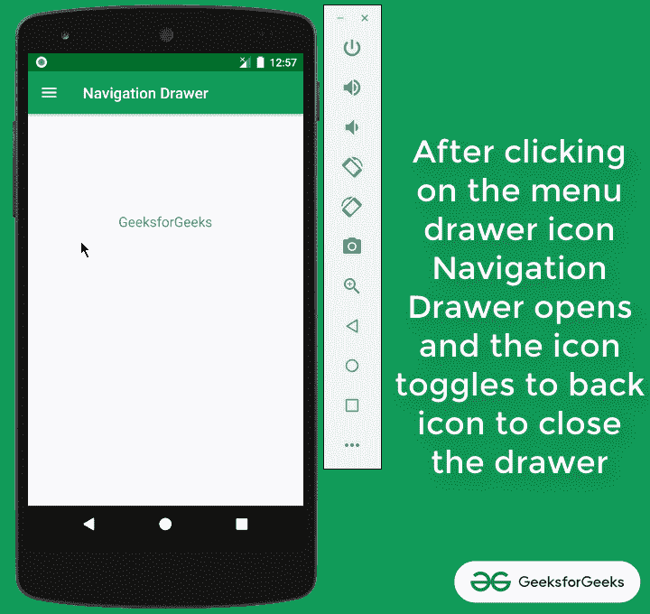
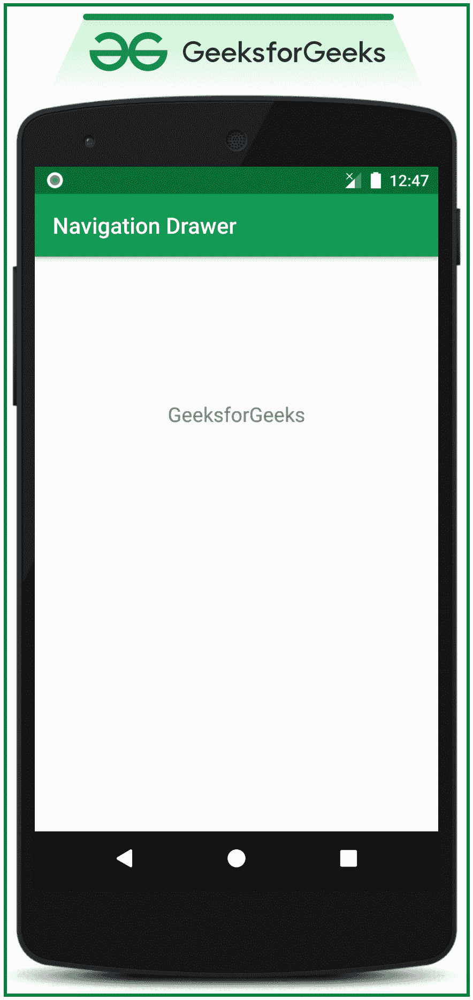

# 安卓导航抽屉

> 原文:[https://www.geeksforgeeks.org/navigation-drawer-in-android/](https://www.geeksforgeeks.org/navigation-drawer-in-android/)

导航抽屉是安卓提供的最常见的功能，导航抽屉是一个显示应用程序主导航菜单的用户界面面板。它也是重要的用户界面元素之一，为用户提供更好的操作，例如更改用户配置文件、更改应用程序的设置等。在本文中，已经逐步讨论了如何在 android 中实现导航抽屉。

> **导航抽屉从左侧滑入，包含应用的导航目的地。**

当用户从活动的左边缘刷手指时，用户可以查看导航抽屉。他们还可以通过点击动作栏中的应用图标，从家庭活动中找到它。抽屉图标显示在所有使用抽屉的顶级目标上。请看下图，了解一下导航抽屉。



## **在安卓系统中实现导航抽屉的步骤**

**第一步:创建安卓工作室项目**

*   创建一个空的活动安卓工作室项目。
*   参考[安卓|如何在安卓工作室创建/启动新项目？](https://www.geeksforgeeks.org/android-how-to-create-start-a-new-project-in-android-studio/)关于如何创建一个空的活动安卓工作室项目。注意，我们将使用 **Java** 语言来实现这个项目。

**步骤 2:向项目**添加 **依赖项**

*   在本次讨论中，我们将使用材质设计导航抽屉。
*   因此，将以下材料设计依赖项添加到应用程序级渐变文件中。

> 实现' com . Google . Android . material:material:1 . 3 . 0-alpha 03 '

*   如果找不到应用程序级渐变文件，请参考下图(在项目层次视图下)。
*   调用依赖后点击****立即同步****按钮。确保系统连接到网络，以便安卓工作室下载所需的文件。****

********

******第三步:在菜单文件夹**中创建菜单****

*   ****在 res 文件夹下创建菜单文件夹。来实现菜单。****
*   ****请参考下面的视频来创建实现菜单的布局。****

****<video class="wp-video-shortcode" id="video-513762-1" width="640" height="360" preload="metadata" controls=""><source type="video/mp4" src="https://media.geeksforgeeks.org/wp-content/uploads/20201114124319/Untitled-Project.mp4?_=1">[https://media.geeksforgeeks.org/wp-content/uploads/20201114124319/Untitled-Project.mp4](https://media.geeksforgeeks.org/wp-content/uploads/20201114124319/Untitled-Project.mp4)</video>****

*   ****在**导航菜单中调用以下代码******

## ****可扩展标记语言****

```java
**<?xml version="1.0" encoding="utf-8"?>
<menu xmlns:android="http://schemas.android.com/apk/res/android"
    xmlns:tools="http://schemas.android.com/tools"
    tools:ignore="HardcodedText">

    <item
        android:id="@+id/nav_account"
        android:title="My Account" />

    <item
        android:id="@+id/nav_settings"
        android:title="Settings" />

    <item
        android:id="@+id/nav_logout"
        android:title="Logout" />

</menu>**
```

 ******第 4 步:使用 activity_main.xml 文件******

*   ****在 **activity_main.xml** 中调用以下代码来设置导航抽屉所需的基本内容。****

## ****可扩展标记语言****

```java
**<?xml version="1.0" encoding="utf-8"?>

<!--the root view must be the DrawerLayout-->
<androidx.drawerlayout.widget.DrawerLayout
    xmlns:android="http://schemas.android.com/apk/res/android"
    xmlns:app="http://schemas.android.com/apk/res-auto"
    xmlns:tools="http://schemas.android.com/tools"
    android:id="@+id/my_drawer_layout"
    android:layout_width="match_parent"
    android:layout_height="match_parent"
    tools:context=".MainActivity"
    tools:ignore="HardcodedText">

    <LinearLayout
        android:layout_width="match_parent"
        android:layout_height="match_parent">

        <TextView
            android:layout_width="match_parent"
            android:layout_height="wrap_content"
            android:layout_marginTop="128dp"
            android:gravity="center"
            android:text="GeeksforGeeks"
            android:textSize="18sp" />

    </LinearLayout>

    <!--this the navigation view which draws
        and shows the navigation drawer-->
    <!--include the menu created in the menu folder-->
    <com.google.android.material.navigation.NavigationView
        android:layout_width="wrap_content"
        android:layout_height="match_parent"
        android:layout_gravity="start"
        app:menu="@menu/navigation_menu" />

</androidx.drawerlayout.widget.DrawerLayout>**
```

 ******输出 UI:******

********

*   ****需要注意的一点是，菜单抽屉图标仍然没有出现在动作栏上。我们需要以编程方式设置图标及其开闭功能。****

******第五步:在字符串中包含打开关闭字符串******

*   ****在 styles.xml 文件中调用以下代码。****

## ****可扩展标记语言****

```java
**<resources>
    <string name="app_name">Navigation Drawer</string>

    <!--to toggle the open close button
        of the navigation drawer-->
    <string name="nav_open">Open</string>
    <string name="nav_close">Close</string>
</resources>**
```

******步骤 6:使用 MainActivity.java 文件******

*   ****调用**MainActivity.java**文件中的以下代码，在操作栏上显示菜单图标，实现导航抽屉的开闭功能。****
*   ****为了更好地理解，在代码中添加了注释。****

## ****Java 语言(一种计算机语言，尤用于创建网站)****

```java
**import androidx.annotation.NonNull;
import androidx.appcompat.app.ActionBarDrawerToggle;
import androidx.appcompat.app.AppCompatActivity;
import androidx.drawerlayout.widget.DrawerLayout;
import android.os.Bundle;
import android.view.MenuItem;

public class MainActivity extends AppCompatActivity {

    public DrawerLayout drawerLayout;
    public ActionBarDrawerToggle actionBarDrawerToggle;

    @Override
    protected void onCreate(Bundle savedInstanceState) {
        super.onCreate(savedInstanceState);
        setContentView(R.layout.activity_main);

        // drawer layout instance to toggle the menu icon to open
        // drawer and back button to close drawer
        drawerLayout = findViewById(R.id.my_drawer_layout);
        actionBarDrawerToggle = new ActionBarDrawerToggle(this, drawerLayout, R.string.nav_open, R.string.nav_close);

        // pass the Open and Close toggle for the drawer layout listener
        // to toggle the button
        drawerLayout.addDrawerListener(actionBarDrawerToggle);
        actionBarDrawerToggle.syncState();

        // to make the Navigation drawer icon always appear on the action bar
        getSupportActionBar().setDisplayHomeAsUpEnabled(true);
    }

    // override the onOptionsItemSelected()
      // function to implement
    // the item click listener callback
    // to open and close the navigation
      // drawer when the icon is clicked
    @Override
    public boolean onOptionsItemSelected(@NonNull MenuItem item) {

        if (actionBarDrawerToggle.onOptionsItemSelected(item)) {
            return true;
        }
        return super.onOptionsItemSelected(item);
    }
}**
```

### ****输出**:在仿真器**上运行****

****<video class="wp-video-shortcode" id="video-513762-2" width="640" height="360" preload="metadata" controls=""><source type="video/mp4" src="https://media.geeksforgeeks.org/wp-content/uploads/20201114130020/Untitled-Project.mp4?_=2">[https://media.geeksforgeeks.org/wp-content/uploads/20201114130020/Untitled-Project.mp4](https://media.geeksforgeeks.org/wp-content/uploads/20201114130020/Untitled-Project.mp4)</video>****